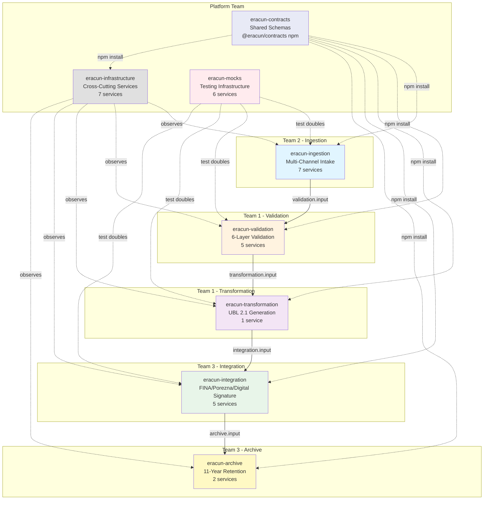
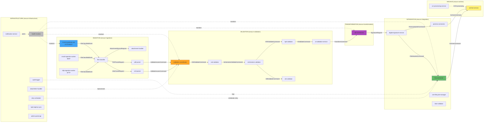
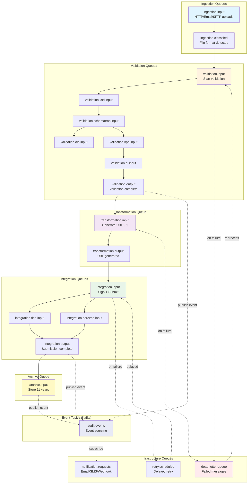
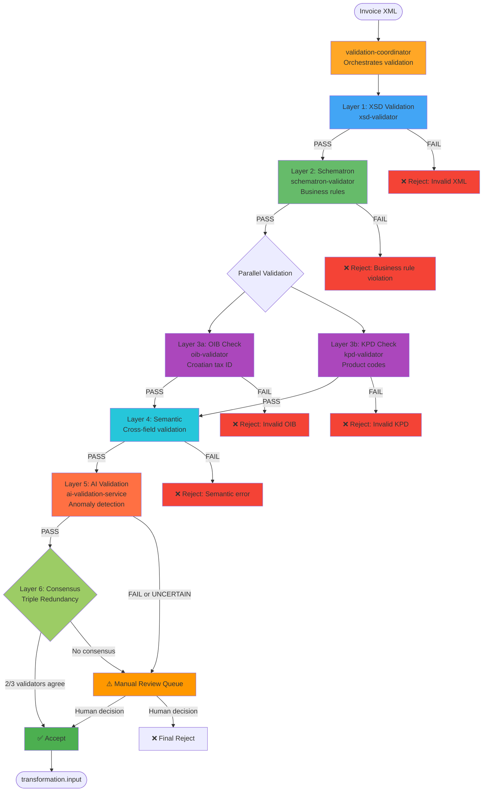
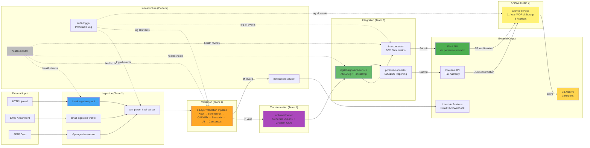
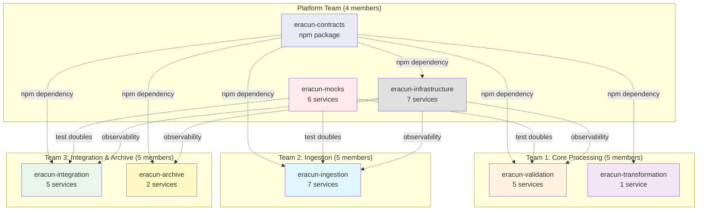
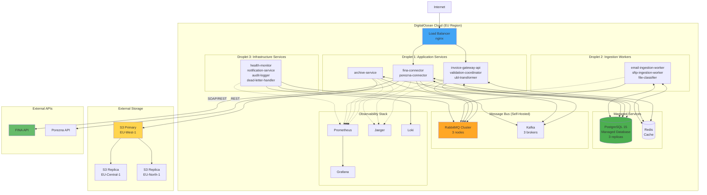

# Architecture Diagrams

**Visual Documentation of eRačun System Architecture**

---

## Table of Contents

1. [High-Level Repository Architecture](#high-level-repository-architecture)
2. [Service Communication Graph](#service-communication-graph)
3. [Message Queue Topology](#message-queue-topology)
4. [Validation Pipeline Flow](#validation-pipeline-flow)
5. [Full System Data Flow](#full-system-data-flow)
6. [Team Ownership Map](#team-ownership-map)
7. [External Dependencies](#external-dependencies)
8. [Deployment Architecture](#deployment-architecture)

---

## High-Level Repository Architecture

### 8 Independent Repositories



---

## Service Communication Graph

### All 27 Services and Their Communication Paths



---

## Message Queue Topology

### RabbitMQ Queues and Routing



---

## Validation Pipeline Flow

### 6-Layer Validation with Triple Redundancy



---

## Full System Data Flow

### End-to-End Invoice Processing



---

## Team Ownership Map

### 8 Repositories / 4 Teams



---

## External Dependencies

### Third-Party Services and APIs

```mermaid
graph TB
    subgraph "eRačun System"
        SYSTEM[Invoice Processing<br/>Platform]
    end

    subgraph "Croatian Tax Authority"
        FINA[FINA API<br/>cis.porezna-uprava.hr<br/>SOAP]
        POREZNA[Porezna API<br/>Tax Reporting<br/>REST + OAuth2]
    end

    subgraph "Certificate Authorities"
        FINA_CA[FINA CA<br/>X.509 Certificates<br/>~40 EUR/5 years]
        AKD_CA[AKD CA<br/>Alternative CA]
    end

    subgraph "Data Registries"
        KLASUS[KLASUS Registry<br/>data.gov.hr<br/>Product codes]
        OIB_REG[OIB Registry<br/>Croatian tax IDs]
    end

    subgraph "Infrastructure Services"
        DO[DigitalOcean<br/>Droplets + Managed DB]
        S3[S3-Compatible Storage<br/>Archive (11 years)]
    end

    subgraph "Messaging & Observability"
        RABBIT[RabbitMQ<br/>Self-hosted]
        KAFKA[Kafka<br/>Self-hosted]
        PROM[Prometheus<br/>Self-hosted]
        GRAFANA[Grafana<br/>Self-hosted]
        JAEGER[Jaeger<br/>Self-hosted]
    end

    subgraph "Email Services"
        SMTP[SMTP Server<br/>Outbound notifications]
        IMAP[IMAP Server<br/>Email ingestion]
    end

    subgraph "Testing Services (MOCKS)"
        MOCK_FINA[fina-mock<br/>Local testing]
        MOCK_POREZNA[porezna-mock<br/>Local testing]
    end

    SYSTEM -->|Submit B2C| FINA
    SYSTEM -->|Submit B2B/B2G| POREZNA
    SYSTEM -->|Request cert| FINA_CA
    SYSTEM -->|Request cert| AKD_CA
    SYSTEM -->|Sync codes| KLASUS
    SYSTEM -->|Validate OIB| OIB_REG
    SYSTEM -->|Deploy| DO
    SYSTEM -->|Archive| S3
    SYSTEM -->|Messages| RABBIT
    SYSTEM -->|Events| KAFKA
    SYSTEM -->|Metrics| PROM
    SYSTEM -->|Dashboards| GRAFANA
    SYSTEM -->|Traces| JAEGER
    SYSTEM -->|Send email| SMTP
    SYSTEM -->|Receive email| IMAP

    SYSTEM -.->|local dev/test| MOCK_FINA
    SYSTEM -.->|local dev/test| MOCK_POREZNA

    style FINA fill:#4caf50
    style POREZNA fill:#66bb6a
    style FINA_CA fill:#ffa726
    style KLASUS fill:#42a5f5
    style DO fill:#0080ff
    style S3 fill:#ffd54f
    style MOCK_FINA fill:#ffebee
    style MOCK_POREZNA fill:#ffebee
```

---

## Deployment Architecture

### DigitalOcean Infrastructure



---

## Legend

### Diagram Conventions

- **Solid arrows (→)**: Direct message/command flow (synchronous or queued)
- **Dashed arrows (⇢)**: Observation/monitoring (non-blocking)
- **Dotted arrows (⋯>)**: Dependency (npm install, test doubles)
- **Blue boxes**: Ingestion services (Team 2)
- **Orange boxes**: Validation services (Team 1)
- **Purple boxes**: Transformation services (Team 1)
- **Green boxes**: Integration services (Team 3)
- **Yellow boxes**: Archive services (Team 3)
- **Gray boxes**: Infrastructure services (Platform Team)
- **Red boxes**: Mock services (Platform Team)
- **Indigo boxes**: Shared contracts (Platform Team)

---

**Generated:** 2025-11-17
**Version:** 1.0.0
**Maintained by:** Platform Team
**Review Cadence:** Monthly (as architecture evolves)
