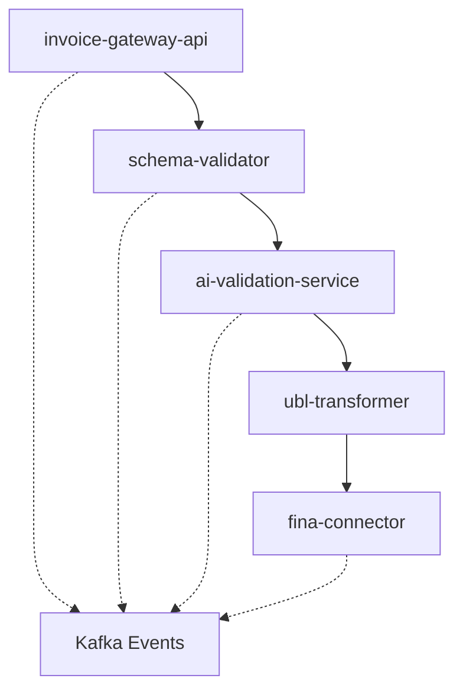

# TASK 6: Service Architecture Compliance Review

## Task Priority
**HIGH** - Architecture violations can cause system-wide failures

## Objective
Verify that all services adhere to the defined architectural patterns, bounded context principles, and the 2,500 LOC limit per service. Ensure proper separation of concerns and messaging patterns are followed.

## Scope
Architecture review covering:
- Service boundaries and bounded contexts
- Code size limits (2,500 LOC max)
- Message bus patterns (Commands/Events/Queries)
- Database schema isolation
- Shared library usage
- CQRS implementation

## Detailed Approach

### 1. Service Size Audit (Day 1)
**LOC count for each service:**
```bash
# Count lines of code per service (excluding tests)
for service in services/*/; do
  echo "=== ${service} ==="
  find "${service}/src" -name "*.ts" -o -name "*.js" | \
    xargs wc -l | tail -1
done

# Flag any service >2,500 LOC
```

**Size compliance checklist:**
- [ ] All services ≤2,500 LOC (excluding tests)
- [ ] Large services identified for splitting
- [ ] Code duplication analysis completed
- [ ] Dead code removed
- [ ] Comments and documentation excluded from count

### 2. Bounded Context Verification (Day 1-2)
**Service responsibility audit:**
| Service | Expected Context | Actual Context | Violations |
|---------|-----------------|----------------|------------|
| invoice-gateway-api | Invoice Ingestion | ? | ? |
| email-ingestion-worker | Email Processing | ? | ? |
| schema-validator | Schema Validation | ? | ? |
| ai-validation-service | AI Verification | ? | ? |
| fina-connector | FINA Integration | ? | ? |

**Boundary violation checks:**
- [ ] No direct database access across services
- [ ] No shared domain models (except via shared/)
- [ ] Clear service ownership of data
- [ ] Single responsibility per service
- [ ] No circular dependencies

### 3. Message Pattern Compliance (Day 2)
**Command/Event/Query separation:**
```javascript
// Verify message patterns
// Commands (RabbitMQ RPC)
const commands = [
  'ValidateInvoiceCommand',
  'SubmitToFinaCommand',
  'TransformToUBLCommand'
];

// Events (Kafka)
const events = [
  'InvoiceReceivedEvent',
  'InvoiceValidatedEvent',
  'InvoiceSubmittedEvent'
];

// Queries (HTTP/gRPC) - should be minimal
const queries = [
  'GetInvoiceStatus',
  'GetValidationReport'
];
```

**Messaging audit checklist:**
- [ ] Commands use RabbitMQ exclusively
- [ ] Events published to Kafka topics
- [ ] Synchronous queries minimized
- [ ] Message schemas in Protocol Buffers
- [ ] Version compatibility maintained
- [ ] Dead letter queues configured

### 4. Database Isolation Review (Day 2-3)
**Schema separation verification:**
```sql
-- List all schemas
SELECT schema_name
FROM information_schema.schemata
WHERE schema_name LIKE '%eracun%';

-- Check for cross-schema queries
SELECT *
FROM pg_stat_statements
WHERE query LIKE '%JOIN%'
  AND query ~ '\w+\.\w+\.\w+';
```

**Database isolation checklist:**
- [ ] One schema per service
- [ ] No cross-schema joins
- [ ] Foreign keys only within schema
- [ ] Shared reference data duplicated
- [ ] Event sourcing for cross-service data
- [ ] Migration files service-specific

### 5. Shared Library Usage Audit (Day 3)
**Verify 3+ usage rule:**
```bash
# Check shared library imports
for lib in shared/*/; do
  echo "=== ${lib} ==="
  grep -r "from '@eracun/${lib}'" services/ | \
    cut -d: -f1 | sort -u | wc -l
done
```

**Shared code checklist:**
- [ ] Only patterns used 3+ times extracted
- [ ] Performance impact documented
- [ ] Bundle size impact <10KB
- [ ] No runtime overhead >1ms
- [ ] Semantic versioning used
- [ ] Tree-shaking compatible

### 6. CQRS Implementation Review (Day 3-4)
**Command/Query separation:**
- [ ] Write models separate from read models
- [ ] Commands modify state only
- [ ] Queries never modify state
- [ ] Event sourcing for state changes
- [ ] Projection services for read models
- [ ] Eventual consistency handled

### 7. Service Communication Audit (Day 4)
**Inter-service dependency map:**


**Communication patterns checklist:**
- [ ] No synchronous service chains >3 deep
- [ ] Circuit breakers on all external calls
- [ ] Timeout budgets defined
- [ ] Retry policies consistent
- [ ] Request IDs propagated
- [ ] Distributed tracing enabled

## Required Tools
- cloc for line counting
- Dependency graph generators
- Database schema analyzers
- Message flow visualization tools
- Architecture decision record tools

## Pass/Fail Criteria

### MUST PASS (Architecture requirements)
- ✅ All services ≤2,500 LOC
- ✅ Bounded contexts clearly defined
- ✅ No database schema violations
- ✅ Message patterns correctly used
- ✅ Shared code follows 3+ rule

### RED FLAGS (Architecture violations)
- ❌ Services >2,500 LOC
- ❌ Cross-service database access
- ❌ Synchronous query chains
- ❌ Circular dependencies
- ❌ Premature abstraction

## Deliverables
1. **Architecture Compliance Report** - All services reviewed
2. **Service Dependency Graph** - Visual representation
3. **Violation List** - Non-compliant components
4. **Refactoring Plan** - Fix timeline for violations
5. **ADR Updates** - New decisions documented

## Time Estimate
- **Duration:** 4 days
- **Effort:** 1 senior architect
- **Prerequisites:** All services accessible, documentation current

## Risk Factors
- **High Risk:** Service boundaries violated
- **High Risk:** Database coupling between services
- **Medium Risk:** Oversized services
- **Medium Risk:** Message pattern misuse
- **Low Risk:** Minor naming violations

## Escalation Path
For architecture violations:
1. Document violation in ADR
2. Assess refactoring impact
3. Create PENDING item if not immediate
4. Plan refactoring sprint
5. Update architecture documentation

## Architecture Principles

### Domain-Driven Design
- Ubiquitous language per bounded context
- Aggregates define transaction boundaries
- Domain events for integration
- Anti-corruption layers for external systems

### Microservices Best Practices
- Independent deployment
- Technology heterogeneity allowed
- Fault isolation
- Decentralized governance
- Service ownership model

## Related Documentation
- @docs/ARCHITECTURE.md
- @docs/adr/ (All architecture decisions)
- Service README files
- @docs/api-contracts/ (Service APIs)
- Message schema definitions (.proto files)

## Architecture Checklist
- [ ] Service catalog up to date
- [ ] API contracts documented
- [ ] Message flows documented
- [ ] Database schemas documented
- [ ] Deployment topology clear
- [ ] Monitoring strategy defined
- [ ] Security boundaries identified
- [ ] Performance budgets allocated
- [ ] Cost allocation understood
- [ ] Team ownership assigned

## Notes
Architecture compliance is critical for long-term maintainability. The 2,500 LOC limit ensures services remain manageable and fit within AI context windows for assistance. Violations should be addressed before they become technical debt.