# ADR-003: System Decomposition and Integration Architecture

**Status:** 🚧 In Progress
**Date:** 2025-11-10
**Deciders:** System Architect
**Technical Story:** Complete system-wide architecture before bounded context implementation

---

## Context

After establishing configuration management (ADR-001) and secrets management (ADR-002), we need to define the complete system architecture before implementing individual bounded contexts. This ADR combines four tightly coupled artifacts:

1. **Service Catalog (Nodes)** - All bounded contexts with responsibilities
2. **Message Catalog (Contracts)** - All inter-service communication schemas
3. **Integration Topology (Edges)** - Dependency graph and message routing
4. **Processing Pipelines** - End-to-end workflows with error handling

**Why Single ADR?** These artifacts are interdependent - changes to one affect others. A unified document provides a holistic view and maintains consistency.

---

## Section 1: Complete Service Catalog (Nodes)

**Completion:** ✅ TODO-001 Complete

### 1.1 Catalog Overview

This catalog defines all 29 bounded contexts in the eRacun platform, organized by architectural layer. Each service adheres to:
- **2,500 LOC limit** (excluding tests)
- **Single responsibility principle**
- **Independent deployment** (systemd units)
- **Clear input/output contracts**

---

### 1.2 Service Catalog by Layer

#### Layer 1: Ingestion (4 services)

| Service Name | Single Responsibility | Complexity | Dependencies | Upstream | Downstream |
|--------------|----------------------|------------|--------------|----------|------------|
| **email-ingestion-worker** | Monitor IMAP mailbox, extract invoice attachments, publish to message bus | Medium (1,500 LOC) | IMAP server, RabbitMQ | None (email system) | attachment-handler |
| **api-gateway** | REST/gRPC API for invoice upload, authentication, rate limiting | Medium (2,000 LOC) | PostgreSQL (auth), RabbitMQ | Client applications | file-classifier |
| **as4-gateway-receiver** | Receive AS4 messages from external Access Points, verify transport security | High (2,500 LOC) | AS4 protocol stack, RabbitMQ | External AS4 gateways | signature-verifier |
| **web-upload-handler** | Accept multipart/form-data uploads from web portal, validate file types | Low (800 LOC) | RabbitMQ | Web frontend | file-classifier |

**Layer Purpose:** Accept invoices from all channels (email, API, AS4, web) and route to processing pipeline.

**Rationale:**
- **Why 4 services?** Each ingestion channel has distinct protocol requirements (IMAP, HTTP, AS4)
- **Security boundary:** Each service validates input at entry point (defense in depth)
- **Scalability:** Independent scaling per channel (email vs. API traffic patterns differ)

---

#### Layer 2: Parsing & Extraction (4 services)

| Service Name | Single Responsibility | Complexity | Dependencies | Upstream | Downstream |
|--------------|----------------------|------------|--------------|----------|------------|
| **file-classifier** | Detect file type (PDF, XML, image), route to appropriate parser | Low (600 LOC) | Magic numbers library | api-gateway, web-upload-handler | pdf-parser, xml-parser, ocr-service |
| **attachment-handler** | Extract attachments from email MIME, detect invoice files | Low (800 LOC) | MIME parser | email-ingestion-worker | file-classifier |
| **pdf-parser** | Extract text from PDF invoices using PDF.js/pdfplumber | Medium (1,800 LOC) | PDF parsing library | file-classifier | data-extractor |
| **ocr-service** | OCR for scanned images/PDFs using Tesseract OCR | High (2,200 LOC) | Tesseract, image preprocessing | file-classifier | data-extractor |

**Layer Purpose:** Convert various input formats (PDF, image, XML) to structured data.

**Rationale:**
- **Why separate PDF/OCR?** Different processing techniques (text extraction vs. image recognition)
- **Performance:** OCR is CPU-intensive (separate service enables dedicated resource allocation)
- **Complexity isolation:** PDF parsing and OCR have different error modes

---

#### Layer 3: Data Extraction & Normalization (2 services)

| Service Name | Single Responsibility | Complexity | Dependencies | Upstream | Downstream |
|--------------|----------------------|------------|--------------|----------|------------|
| **data-extractor** | Extract invoice fields from text using regex/NLP, map to canonical data model | High (2,500 LOC) | NLP library (compromise) | pdf-parser, ocr-service | data-normalizer |
| **xml-parser** | Parse existing XML invoices (UBL, CII), validate well-formedness | Low (900 LOC) | XML parser (libxml2) | file-classifier | xsd-validator |

**Layer Purpose:** Extract structured invoice data from parsed text/XML.

**Rationale:**
- **Why separate extractor?** Data extraction logic is complex (regex patterns, field mapping)
- **Machine learning integration:** data-extractor is the integration point for future ML models
- **xml-parser independence:** XML invoices bypass data-extractor (already structured)

---

#### Layer 4: Validation Pipeline (8 services)

| Service Name | Single Responsibility | Complexity | Dependencies | Upstream | Downstream |
|--------------|----------------------|------------|--------------|----------|------------|
| **xsd-validator** | Validate XML against UBL 2.1 XSD schemas | Medium (1,200 LOC) | UBL 2.1 schemas, libxml2 | xml-parser, data-normalizer | schematron-validator |
| **schematron-validator** | Apply Croatian CIUS business rules via Schematron | High (2,000 LOC) | Schematron engine | xsd-validator | kpd-validator |
| **kpd-validator** | Validate KPD product codes against KLASUS registry | Medium (1,500 LOC) | PostgreSQL (KPD cache), DZS API | schematron-validator | oib-validator |
| **oib-validator** | Validate Croatian tax numbers (OIB), checksum algorithm | Low (500 LOC) | OIB checksum library | kpd-validator | business-rules-engine |
| **business-rules-engine** | Verify VAT calculations, totals, payment terms | High (2,500 LOC) | None (pure logic) | oib-validator | signature-verifier (if new invoice) |
| **signature-verifier** | Verify XMLDSig signatures, certificate chain, expiration | High (2,200 LOC) | OpenSSL, FINA CA certificates | as4-gateway-receiver, business-rules-engine | ubl-transformer |
| **data-normalizer** | Transform extracted data into canonical UBL-compatible format | Medium (1,800 LOC) | None | data-extractor | xsd-validator |
| **duplicate-detector** | Detect duplicate invoices by invoice number + OIB | Medium (1,200 LOC) | PostgreSQL (invoice index) | business-rules-engine | ubl-transformer |

**Layer Purpose:** Multi-layer validation ensuring regulatory compliance before fiscalization.

**Rationale:**
- **Why 8 validators?** Each represents a distinct compliance requirement (XSD, Schematron, KPD, OIB, business rules, signatures, normalization, duplicates)
- **Sequential validation:** Fail fast (XSD before business rules saves compute)
- **Regulatory mapping:** Each validator maps to specific Croatian regulation
- **Idempotency:** duplicate-detector prevents reprocessing

---

#### Layer 5: Transformation & Enrichment (2 services)

| Service Name | Single Responsibility | Complexity | Dependencies | Upstream | Downstream |
|--------------|----------------------|------------|--------------|----------|------------|
| **ubl-transformer** | Transform validated data to final UBL 2.1 XML format | Medium (2,000 LOC) | UBL templates | signature-verifier, duplicate-detector | digital-signature-service |
| **metadata-enricher** | Add submission metadata, routing information, timestamps | Low (700 LOC) | AMS client (address lookup) | ubl-transformer | digital-signature-service |

**Layer Purpose:** Convert validated data to submission-ready UBL 2.1 format.

**Rationale:**
- **Why separate transformer?** UBL generation is complex (namespaces, structure)
- **metadata-enricher:** Adds system-generated fields (submission timestamps, routing)

---

#### Layer 6: Cryptographic Services (3 services)

| Service Name | Single Responsibility | Complexity | Dependencies | Upstream | Downstream |
|--------------|----------------------|------------|--------------|----------|------------|
| **digital-signature-service** | Apply XMLDSig signatures using FINA certificates | High (2,300 LOC) | OpenSSL, FINA .p12 certs | metadata-enricher | timestamp-service |
| **timestamp-service** | Add eIDAS-compliant qualified timestamps | Medium (1,500 LOC) | eIDAS TSA (external) | digital-signature-service | submission-router |
| **zki-calculator** | Calculate ZKI protective code (MD5 hash) for B2C receipts | Low (400 LOC) | MD5 library | digital-signature-service | fina-soap-connector |

**Layer Purpose:** Apply digital signatures and timestamps for non-repudiation.

**Rationale:**
- **Why separate signing service?** Certificate management is complex (HSM integration, key rotation)
- **Security isolation:** Private keys accessed only by signing service
- **Timestamp independence:** Optional for B2C, required for B2B

---

#### Layer 7: Submission & Integration (5 services)

| Service Name | Single Responsibility | Complexity | Dependencies | Upstream | Downstream |
|--------------|----------------------|------------|--------------|----------|------------|
| **submission-router** | Route invoices to appropriate submission service (B2C/B2B/B2G) | Low (800 LOC) | None | timestamp-service | fina-soap-connector, as4-gateway-sender, eporezna-connector |
| **fina-soap-connector** | Submit B2C invoices via SOAP API to FINA fiscalization service | High (2,400 LOC) | SOAP client, circuit breaker | submission-router, zki-calculator | archive-service |
| **as4-gateway-sender** | Send B2B invoices via AS4 protocol to recipient Access Points | High (2,500 LOC) | AS4 protocol stack | submission-router | archive-service |
| **eporezna-connector** | Submit e-reporting data to ePorezna portal API | Medium (1,600 LOC) | ePorezna API client | submission-router | archive-service |
| **ams-client** | Query Address Metadata Service for recipient Access Point URLs | Low (600 LOC) | AMS REST/SOAP API | metadata-enricher | as4-gateway-sender |

**Layer Purpose:** Submit fiscalized invoices to Croatian Tax Authority systems.

**Rationale:**
- **Why 3 connectors?** Each external system has distinct protocol (SOAP, AS4, REST)
- **Circuit breakers:** External APIs are outside our control (need resilience)
- **submission-router:** Decouples submission logic from validation pipeline

---

#### Layer 8: Archiving & Compliance (4 services)

| Service Name | Single Responsibility | Complexity | Dependencies | Upstream | Downstream |
|--------------|----------------------|------------|--------------|----------|------------|
| **archive-service** | Store invoices in immutable S3-compatible storage (11-year retention) | Medium (1,800 LOC) | DigitalOcean Spaces, PostgreSQL (index) | fina-soap-connector, as4-gateway-sender, eporezna-connector | None |
| **signature-verification-scheduler** | Monthly job to verify archived invoice signatures remain valid | Low (900 LOC) | OpenSSL, PostgreSQL | archive-service (query) | notification-service |
| **retrieval-service** | Retrieve archived invoices with audit logging | Medium (1,200 LOC) | DigitalOcean Spaces, PostgreSQL | User requests | None |
| **cold-storage-migrator** | Move invoices >1 year old to Glacier-class storage (cost optimization) | Low (700 LOC) | DigitalOcean Spaces | archive-service | None |

**Layer Purpose:** 11-year compliant archiving with immutability and integrity verification.

**Rationale:**
- **Why separate archive service?** Archiving is a distinct compliance concern
- **signature-verification-scheduler:** Regulatory requirement (periodic integrity checks)
- **cold-storage-migrator:** Cost optimization (Glacier after 1 year)

---

#### Layer 9: Infrastructure Services (5 services)

| Service Name | Single Responsibility | Complexity | Dependencies | Upstream | Downstream |
|--------------|----------------------|------------|--------------|----------|------------|
| **audit-logger** | Write immutable audit trail to append-only log | Medium (1,500 LOC) | PostgreSQL (append-only), Kafka | All services (via events) | None |
| **dead-letter-handler** | Monitor DLQ, classify errors, route to manual review or retry | Medium (1,800 LOC) | RabbitMQ, PostgreSQL | All services (via DLQ) | notification-service, retry-scheduler |
| **health-monitor** | System-wide health checks, dependency status, circuit breaker states | Medium (1,400 LOC) | All services (health endpoints) | None | notification-service |
| **notification-service** | Send email/SMS alerts for errors, confirmations, reminders | Low (900 LOC) | SMTP, SMS gateway | dead-letter-handler, health-monitor | None |
| **retry-scheduler** | Schedule retries for transient failures with exponential backoff | Medium (1,200 LOC) | RabbitMQ, PostgreSQL | dead-letter-handler | Original service queues |

**Layer Purpose:** Cross-cutting infrastructure concerns (audit, error handling, monitoring).

**Rationale:**
- **Why separate audit logger?** Immutability requirement (never modify audit records)
- **dead-letter-handler:** Centralized error recovery (not duplicated per service)
- **retry-scheduler:** Consistent retry logic (exponential backoff with jitter)

---

#### Layer 10: Management & Administration (3 services)

| Service Name | Single Responsibility | Complexity | Dependencies | Upstream | Downstream |
|--------------|----------------------|------------|--------------|----------|------------|
| **certificate-lifecycle-manager** | Monitor certificate expiration, trigger renewals, handle revocation | High (2,200 LOC) | FINA CMS API, PostgreSQL | None (scheduled) | notification-service, digital-signature-service |
| **kpd-registry-sync** | Sync KLASUS product codes from DZS, update local cache | Low (800 LOC) | DZS API, PostgreSQL | None (scheduled) | kpd-validator |
| **admin-portal-api** | REST API for admin UI (user management, manual review, reporting) | Medium (2,000 LOC) | PostgreSQL, all services (queries) | Admin UI | Various services |

**Layer Purpose:** Operational management and administrative tasks.

**Rationale:**
- **certificate-lifecycle-manager:** Critical for uninterrupted operation (certs expire)
- **kpd-registry-sync:** KLASUS codes change periodically (need updates)
- **admin-portal-api:** Human-in-the-loop for manual review, corrections

---

### 1.3 Service Count Summary

| Layer | Service Count | Total LOC (Est.) |
|-------|---------------|------------------|
| Ingestion | 4 | 5,300 |
| Parsing & Extraction | 4 | 5,400 |
| Data Extraction & Normalization | 2 | 3,400 |
| Validation Pipeline | 8 | 13,100 |
| Transformation & Enrichment | 2 | 2,700 |
| Cryptographic Services | 3 | 4,200 |
| Submission & Integration | 5 | 7,900 |
| Archiving & Compliance | 4 | 4,600 |
| Infrastructure Services | 5 | 6,800 |
| Management & Administration | 3 | 5,000 |
| **TOTAL** | **40** | **58,400** |

**Analysis:**
- Average service size: 1,460 LOC (well under 2,500 LOC limit)
- Largest service: as4-gateway-sender (2,500 LOC at limit)
- Smallest service: zki-calculator (400 LOC)

---

### 1.4 Validation Against Design Principles

**✅ Single Responsibility:** Each service has ONE clear purpose
**✅ Context-Window Optimized:** Largest service fits in <2,500 LOC
**✅ Independent Development:** Services can be developed in parallel
**✅ Clear Boundaries:** Input/output contracts explicit (see Section 2)
**✅ Measurable Business Value:** Each service maps to regulatory requirement or pipeline stage

---

## Section 2: System-Wide Message Catalog (Contracts)

**Completion:** 🚧 TODO-002 In Progress

### 2.1 Message Taxonomy

All inter-service communication uses Protocol Buffers for type-safe, versioned schemas.

**Message Types:**
1. **Commands** (RabbitMQ RPC) - Request/response, requires acknowledgment
2. **Events** (Kafka) - Fire-and-forget, broadcast state changes
3. **Queries** (gRPC) - Synchronous reads, limited use

**Naming Conventions:**
- Commands: `{Verb}{Entity}Command` (e.g., `ParseInvoiceCommand`)
- Events: `{Entity}{PastTenseVerb}Event` (e.g., `InvoiceParsedEvent`)
- Queries: `Get{Entity}Query` (e.g., `GetInvoiceStatusQuery`)

---

### 2.2 Core Message Schemas (Protocol Buffers)

**File Location:** `/docs/api-contracts/protobuf/`

#### Common Types (`common.proto`)

```protobuf
syntax = "proto3";

package eracun.v1.common;

// Unique identifier for invoices (idempotency key)
message InvoiceId {
  string uuid = 1; // UUID v4
}

// Invoice transaction types
enum InvoiceType {
  INVOICE_TYPE_UNSPECIFIED = 0;
  B2C = 1; // Business to Consumer
  B2B = 2; // Business to Business
  B2G = 3; // Business to Government
}

// Processing stages
enum ProcessingStage {
  PROCESSING_STAGE_UNSPECIFIED = 0;
  INGESTED = 1;
  PARSED = 2;
  VALIDATED = 3;
  SIGNED = 4;
  SUBMITTED = 5;
  ARCHIVED = 6;
  FAILED = 7;
}

// Croatian OIB (tax number)
message OIB {
  string value = 1; // 11 digits
}

// KPD product classification code
message KPDCode {
  string value = 1; // Minimum 6 digits
}

// Request context (propagated through all services)
message RequestContext {
  string request_id = 1; // UUID for tracing
  string user_id = 2; // Authenticated user (if applicable)
  int64 timestamp_ms = 3; // Unix timestamp in milliseconds
  InvoiceType invoice_type = 4;
}

// Error details
message Error {
  string code = 1; // Error code (e.g., "XSD_VALIDATION_FAILED")
  string message = 2; // Human-readable message
  string field = 3; // Field that caused error (if applicable)
  repeated string details = 4; // Additional context
}
```

---

#### Ingestion Commands (`ingestion.proto`)

```protobuf
syntax = "proto3";

package eracun.v1.ingestion;

import "common.proto";

// Command: Email worker publishes extracted attachment
message ProcessEmailAttachmentCommand {
  common.RequestContext context = 1;
  string email_id = 2; // Email message ID
  string attachment_filename = 3;
  bytes attachment_content = 4;
  string content_type = 5; // MIME type
  string sender_email = 6;
}

// Command: API gateway publishes uploaded file
message ProcessUploadedFileCommand {
  common.RequestContext context = 1;
  string filename = 2;
  bytes file_content = 3;
  string content_type = 4;
  string uploader_user_id = 5;
}

// Command: AS4 gateway publishes received invoice
message ProcessAS4InvoiceCommand {
  common.RequestContext context = 1;
  string as4_message_id = 2;
  bytes ubl_xml = 3; // Already XML
  string sender_oib = 4;
  string recipient_oib = 5;
  int64 received_timestamp_ms = 6;
}
```

---

#### Parsing Commands (`parsing.proto`)

```protobuf
syntax = "proto3";

package eracun.v1.parsing;

import "common.proto";

// Command: Classify file type
message ClassifyFileCommand {
  common.RequestContext context = 1;
  bytes file_content = 2;
  string filename = 3;
}

// Response: File classification result
message ClassifyFileResponse {
  common.InvoiceId invoice_id = 1;
  FileType detected_type = 2;
  float confidence = 3; // 0.0 - 1.0
}

enum FileType {
  FILE_TYPE_UNSPECIFIED = 0;
  PDF = 1;
  XML = 2;
  IMAGE_PNG = 3;
  IMAGE_JPEG = 4;
}

// Command: Parse PDF invoice
message ParsePDFCommand {
  common.RequestContext context = 1;
  common.InvoiceId invoice_id = 2;
  bytes pdf_content = 3;
}

// Response: Extracted text
message ParsePDFResponse {
  common.InvoiceId invoice_id = 1;
  string extracted_text = 2;
  int32 page_count = 3;
}

// Command: OCR scanned image
message OCRImageCommand {
  common.RequestContext context = 1;
  common.InvoiceId invoice_id = 2;
  bytes image_content = 3;
  FileType image_type = 4;
}

// Response: OCR result
message OCRImageResponse {
  common.InvoiceId invoice_id = 1;
  string recognized_text = 2;
  float confidence = 3; // Average OCR confidence
}
```

---

#### Validation Commands (`validation.proto`)

```protobuf
syntax = "proto3";

package eracun.v1.validation;

import "common.proto";

// Command: Validate XML against XSD schema
message ValidateXSDCommand {
  common.RequestContext context = 1;
  common.InvoiceId invoice_id = 2;
  bytes xml_content = 3;
  SchemaType schema_type = 4;
}

enum SchemaType {
  SCHEMA_TYPE_UNSPECIFIED = 0;
  UBL_2_1 = 1;
  CII_2_0 = 2;
}

// Response: XSD validation result
message ValidateXSDResponse {
  common.InvoiceId invoice_id = 1;
  ValidationStatus status = 2;
  repeated common.Error errors = 3;
}

enum ValidationStatus {
  VALIDATION_STATUS_UNSPECIFIED = 0;
  VALID = 1;
  INVALID = 2;
  ERROR = 3; // System error (not validation failure)
}

// Command: Apply Schematron business rules
message ValidateSchematronCommand {
  common.RequestContext context = 1;
  common.InvoiceId invoice_id = 2;
  bytes xml_content = 3;
  string cius_version = 4; // Croatian CIUS version
}

// Response: Schematron validation result
message ValidateSchematronResponse {
  common.InvoiceId invoice_id = 1;
  ValidationStatus status = 2;
  repeated SchematronError errors = 3;
}

message SchematronError {
  string rule_id = 1; // Schematron rule ID (e.g., "BR-CO-04")
  string message = 2;
  string xpath = 3; // XPath to problematic element
  Severity severity = 4;
}

enum Severity {
  SEVERITY_UNSPECIFIED = 0;
  ERROR = 1;
  WARNING = 2;
  INFO = 3;
}

// Command: Validate KPD codes
message ValidateKPDCommand {
  common.RequestContext context = 1;
  common.InvoiceId invoice_id = 2;
  repeated common.KPDCode kpd_codes = 3;
}

// Response: KPD validation result
message ValidateKPDResponse {
  common.InvoiceId invoice_id = 1;
  repeated KPDValidationResult results = 2;
}

message KPDValidationResult {
  common.KPDCode code = 1;
  bool is_valid = 2;
  string description = 3; // Product description from KLASUS
  string error_message = 4; // If invalid
}
```

---

#### Event Messages (`events.proto`)

```protobuf
syntax = "proto3";

package eracun.v1.events;

import "common.proto";

// Event: Invoice successfully ingested
message InvoiceIngestedEvent {
  common.InvoiceId invoice_id = 1;
  common.RequestContext context = 2;
  string source_channel = 3; // "email", "api", "as4", "web"
  int64 ingested_at_ms = 4;
}

// Event: Invoice parsing completed
message InvoiceParsedEvent {
  common.InvoiceId invoice_id = 1;
  common.RequestContext context = 2;
  ParsingMethod method = 3; // "pdf", "ocr", "xml"
  bool success = 4;
  int64 parsed_at_ms = 5;
}

enum ParsingMethod {
  PARSING_METHOD_UNSPECIFIED = 0;
  PDF = 1;
  OCR = 2;
  XML = 3;
}

// Event: Invoice validation completed
message InvoiceValidatedEvent {
  common.InvoiceId invoice_id = 1;
  common.RequestContext context = 2;
  bool is_valid = 3;
  repeated string failed_validators = 4; // "xsd", "schematron", "kpd", etc.
  int64 validated_at_ms = 5;
}

// Event: Invoice signed
message InvoiceSignedEvent {
  common.InvoiceId invoice_id = 1;
  common.RequestContext context = 2;
  string certificate_serial = 3;
  int64 signed_at_ms = 4;
}

// Event: Invoice submitted to Tax Authority
message InvoiceSubmittedEvent {
  common.InvoiceId invoice_id = 1;
  common.RequestContext context = 2;
  SubmissionDestination destination = 3;
  string confirmation_id = 4; // JIR for B2C, UUID for B2B
  int64 submitted_at_ms = 5;
}

enum SubmissionDestination {
  SUBMISSION_DESTINATION_UNSPECIFIED = 0;
  FINA_SOAP = 1; // B2C
  AS4_GATEWAY = 2; // B2B
  EPOREZNA = 3; // e-reporting
}

// Event: Invoice archived
message InvoiceArchivedEvent {
  common.InvoiceId invoice_id = 1;
  common.RequestContext context = 2;
  string storage_location = 3; // S3 URL
  int64 archived_at_ms = 4;
  int64 retention_expires_at_ms = 5; // 11 years from now
}

// Event: Invoice processing failed
message InvoiceFailedEvent {
  common.InvoiceId invoice_id = 1;
  common.RequestContext context = 2;
  common.ProcessingStage failed_at_stage = 3;
  repeated common.Error errors = 4;
  bool retryable = 5;
  int64 failed_at_ms = 6;
}
```

---

### 2.3 Message Versioning Strategy

**Semantic Versioning:**
- **Major version** (v1 → v2): Breaking changes (field removal, type changes)
- **Minor version** (v1.0 → v1.1): Backward-compatible additions (new optional fields)
- **Patch version** (v1.0.0 → v1.0.1): Documentation, comments only

**Protocol Buffer Compatibility Rules:**
1. **Never change field numbers** (breaks binary compatibility)
2. **Never remove required fields** (use `deprecated` option instead)
3. **Add new fields as optional** with sensible defaults
4. **Use reserved field numbers** for deleted fields

**Example Migration:**
```protobuf
// v1.0 (original)
message InvoiceData {
  string invoice_number = 1;
  int64 amount = 2;
}

// v1.1 (added optional field - backward compatible)
message InvoiceData {
  string invoice_number = 1;
  int64 amount = 2;
  string currency = 3; // NEW, optional, defaults to "HRK"
}

// v2.0 (breaking change - renamed field)
message InvoiceData {
  reserved 2; // Old 'amount' field number
  string invoice_number = 1;
  int64 amount_cents = 4; // NEW field number, changed unit to cents
  string currency = 3;
}
```

---

### 2.4 Message Catalog Table

| Message Name | Type | Producer | Consumers | Purpose | Version |
|--------------|------|----------|-----------|---------|---------|
| `ProcessEmailAttachmentCommand` | Command | email-ingestion-worker | attachment-handler | Submit email attachment for processing | v1.0 |
| `ProcessUploadedFileCommand` | Command | api-gateway, web-upload-handler | file-classifier | Submit uploaded file for classification | v1.0 |
| `ProcessAS4InvoiceCommand` | Command | as4-gateway-receiver | signature-verifier | Submit received AS4 invoice for verification | v1.0 |
| `ClassifyFileCommand` | Command | attachment-handler | file-classifier | Classify file type | v1.0 |
| `ParsePDFCommand` | Command | file-classifier | pdf-parser | Extract text from PDF | v1.0 |
| `OCRImageCommand` | Command | file-classifier | ocr-service | Recognize text from image | v1.0 |
| `ValidateXSDCommand` | Command | xml-parser, data-normalizer | xsd-validator | Validate XML against schema | v1.0 |
| `ValidateSchematronCommand` | Command | xsd-validator | schematron-validator | Apply business rules | v1.0 |
| `ValidateKPDCommand` | Command | schematron-validator | kpd-validator | Validate product codes | v1.0 |
| `InvoiceIngestedEvent` | Event | All ingestion services | audit-logger, monitoring | Invoice entered system | v1.0 |
| `InvoiceParsedEvent` | Event | pdf-parser, ocr-service, xml-parser | audit-logger, monitoring | Parsing completed | v1.0 |
| `InvoiceValidatedEvent` | Event | business-rules-engine | submission-router, audit-logger | Validation completed | v1.0 |
| `InvoiceSignedEvent` | Event | digital-signature-service | audit-logger | Digital signature applied | v1.0 |
| `InvoiceSubmittedEvent` | Event | fina-soap-connector, as4-gateway-sender | archive-service, audit-logger, notification-service | Submitted to Tax Authority | v1.0 |
| `InvoiceArchivedEvent` | Event | archive-service | audit-logger | Archived for 11 years | v1.0 |
| `InvoiceFailedEvent` | Event | All services (on error) | dead-letter-handler, notification-service, audit-logger | Processing failed | v1.0 |

**Total Messages:** 16 (11 commands, 6 events, 0 queries - queries will be gRPC in Phase 2)

---

## Section 3: Integration Topology (Edges)

**Completion:** ✅ TODO-003 Complete

### 3.1 Service Dependency Graph

**Visualization Tool:** Graphviz DOT language

#### 3.1.1 Complete Dependency Graph (DOT Format)

```dot
digraph eRacun_Architecture {
  rankdir=LR;
  node [shape=box, style=rounded];

  // Layer 1: Ingestion
  subgraph cluster_ingestion {
    label="Layer 1: Ingestion";
    style=filled;
    color=lightblue;

    email_worker [label="email-ingestion-worker"];
    api_gateway [label="api-gateway"];
    as4_receiver [label="as4-gateway-receiver"];
    web_upload [label="web-upload-handler"];
  }

  // Layer 2: Parsing & Extraction
  subgraph cluster_parsing {
    label="Layer 2: Parsing";
    style=filled;
    color=lightgreen;

    attachment_handler [label="attachment-handler"];
    file_classifier [label="file-classifier"];
    pdf_parser [label="pdf-parser"];
    ocr_service [label="ocr-service"];
  }

  // Layer 3: Data Extraction
  subgraph cluster_extraction {
    label="Layer 3: Extraction";
    style=filled;
    color=lightyellow;

    xml_parser [label="xml-parser"];
    data_extractor [label="data-extractor"];
    data_normalizer [label="data-normalizer"];
  }

  // Layer 4: Validation
  subgraph cluster_validation {
    label="Layer 4: Validation";
    style=filled;
    color=lightcoral;

    xsd_validator [label="xsd-validator"];
    schematron_validator [label="schematron-validator"];
    kpd_validator [label="kpd-validator"];
    oib_validator [label="oib-validator"];
    business_rules [label="business-rules-engine"];
    signature_verifier [label="signature-verifier"];
    duplicate_detector [label="duplicate-detector"];
  }

  // Layer 5: Transformation
  subgraph cluster_transformation {
    label="Layer 5: Transformation";
    style=filled;
    color=lightgray;

    ubl_transformer [label="ubl-transformer"];
    metadata_enricher [label="metadata-enricher"];
  }

  // Layer 6: Cryptographic
  subgraph cluster_crypto {
    label="Layer 6: Cryptographic";
    style=filled;
    color=lightpink;

    digital_signer [label="digital-signature-service"];
    timestamp_service [label="timestamp-service"];
    zki_calculator [label="zki-calculator"];
  }

  // Layer 7: Submission
  subgraph cluster_submission {
    label="Layer 7: Submission";
    style=filled;
    color=lightcyan;

    submission_router [label="submission-router"];
    fina_connector [label="fina-soap-connector"];
    as4_sender [label="as4-gateway-sender"];
    eporezna_connector [label="eporezna-connector"];
    ams_client [label="ams-client"];
  }

  // Layer 8: Archiving
  subgraph cluster_archive {
    label="Layer 8: Archiving";
    style=filled;
    color=lavender;

    archive_service [label="archive-service"];
  }

  // Layer 9: Infrastructure
  subgraph cluster_infra {
    label="Layer 9: Infrastructure";
    style=filled;
    color=wheat;

    audit_logger [label="audit-logger"];
    dead_letter_handler [label="dead-letter-handler"];
    health_monitor [label="health-monitor"];
    notification_service [label="notification-service"];
    retry_scheduler [label="retry-scheduler"];
  }

  // Dependencies (Edges)

  // Ingestion → Parsing
  email_worker -> attachment_handler [label="RabbitMQ"];
  attachment_handler -> file_classifier [label="RabbitMQ"];
  api_gateway -> file_classifier [label="RabbitMQ"];
  web_upload -> file_classifier [label="RabbitMQ"];
  as4_receiver -> signature_verifier [label="RabbitMQ"];

  // Parsing → Extraction
  file_classifier -> pdf_parser [label="RabbitMQ"];
  file_classifier -> ocr_service [label="RabbitMQ"];
  file_classifier -> xml_parser [label="RabbitMQ"];
  pdf_parser -> data_extractor [label="RabbitMQ"];
  ocr_service -> data_extractor [label="RabbitMQ"];
  data_extractor -> data_normalizer [label="RabbitMQ"];

  // Extraction → Validation
  xml_parser -> xsd_validator [label="RabbitMQ"];
  data_normalizer -> xsd_validator [label="RabbitMQ"];

  // Validation Pipeline (Sequential)
  xsd_validator -> schematron_validator [label="RabbitMQ"];
  schematron_validator -> kpd_validator [label="RabbitMQ"];
  kpd_validator -> oib_validator [label="RabbitMQ"];
  oib_validator -> business_rules [label="RabbitMQ"];
  business_rules -> duplicate_detector [label="RabbitMQ"];

  // Validation → Transformation
  signature_verifier -> ubl_transformer [label="RabbitMQ"];
  duplicate_detector -> ubl_transformer [label="RabbitMQ"];
  ubl_transformer -> metadata_enricher [label="RabbitMQ"];

  // Transformation → Cryptographic
  metadata_enricher -> digital_signer [label="RabbitMQ"];
  digital_signer -> timestamp_service [label="RabbitMQ"];
  digital_signer -> zki_calculator [label="RabbitMQ (B2C only)"];

  // Cryptographic → Submission
  timestamp_service -> submission_router [label="RabbitMQ"];
  submission_router -> fina_connector [label="RabbitMQ (B2C)"];
  submission_router -> as4_sender [label="RabbitMQ (B2B)"];
  submission_router -> eporezna_connector [label="RabbitMQ (reporting)"];
  zki_calculator -> fina_connector [label="RabbitMQ"];

  // AMS lookup (synchronous)
  metadata_enricher -> ams_client [label="gRPC", style=dashed];
  ams_client -> as4_sender [label="result", style=dashed];

  // Submission → Archiving
  fina_connector -> archive_service [label="RabbitMQ"];
  as4_sender -> archive_service [label="RabbitMQ"];
  eporezna_connector -> archive_service [label="RabbitMQ"];

  // Event subscriptions (Kafka - all services publish to audit-logger)
  email_worker -> audit_logger [label="Kafka", color=blue, style=dotted];
  file_classifier -> audit_logger [label="Kafka", color=blue, style=dotted];
  xsd_validator -> audit_logger [label="Kafka", color=blue, style=dotted];
  business_rules -> audit_logger [label="Kafka", color=blue, style=dotted];
  digital_signer -> audit_logger [label="Kafka", color=blue, style=dotted];
  fina_connector -> audit_logger [label="Kafka", color=blue, style=dotted];
  archive_service -> audit_logger [label="Kafka", color=blue, style=dotted];

  // Error handling (all services → DLQ)
  email_worker -> dead_letter_handler [label="DLQ", color=red, style=dotted];
  pdf_parser -> dead_letter_handler [label="DLQ", color=red, style=dotted];
  xsd_validator -> dead_letter_handler [label="DLQ", color=red, style=dotted];

  // Monitoring
  health_monitor -> email_worker [label="health check", style=dashed, dir=back];
  health_monitor -> api_gateway [label="health check", style=dashed, dir=back];

  // Notifications
  dead_letter_handler -> notification_service [label="RabbitMQ"];
  dead_letter_handler -> retry_scheduler [label="RabbitMQ"];
}
```



**Render Command:**
```bash
dot -Tpng architecture.dot -o architecture.png
dot -Tsvg architecture.dot -o architecture.svg
```

---

#### 3.1.2 Dependency Matrix

| Service | Fan-In (Consumers) | Fan-Out (Dependencies) | Critical Path | Notes |
|---------|-------------------|------------------------|---------------|-------|
| **email-ingestion-worker** | 0 | 1 | Yes | Entry point |
| **api-gateway** | 0 | 1 | Yes | Entry point |
| **as4-gateway-receiver** | 0 | 1 | Yes | Entry point |
| **web-upload-handler** | 0 | 1 | Yes | Entry point |
| **attachment-handler** | 1 | 1 | Yes | - |
| **file-classifier** | 3 | 3 | Yes | High fan-in (3 ingestion sources) |
| **pdf-parser** | 1 | 1 | Yes | - |
| **ocr-service** | 1 | 1 | Yes | CPU-intensive |
| **xml-parser** | 1 | 1 | No | XML bypass path |
| **data-extractor** | 2 | 1 | Yes | - |
| **data-normalizer** | 1 | 1 | Yes | - |
| **xsd-validator** | 2 | 1 | Yes | First validator |
| **schematron-validator** | 1 | 1 | Yes | - |
| **kpd-validator** | 1 | 1 | Yes | - |
| **oib-validator** | 1 | 1 | Yes | - |
| **business-rules-engine** | 1 | 1 | Yes | Complex logic |
| **signature-verifier** | 1 | 1 | Yes | AS4 entry validation |
| **duplicate-detector** | 1 | 1 | Yes | - |
| **ubl-transformer** | 2 | 1 | Yes | - |
| **metadata-enricher** | 1 | 2 | Yes | Calls AMS (sync) |
| **digital-signature-service** | 1 | 2 | Yes | Private key access |
| **timestamp-service** | 1 | 1 | Yes | External TSA |
| **zki-calculator** | 1 | 1 | No | B2C only |
| **submission-router** | 1 | 3 | Yes | Routing logic |
| **fina-soap-connector** | 2 | 1 | Yes | External API |
| **as4-gateway-sender** | 1 | 1 | Yes | External API |
| **eporezna-connector** | 1 | 1 | No | Reporting only |
| **ams-client** | 1 | 0 | Yes | External lookup |
| **archive-service** | 3 | 0 | Yes | High fan-in (3 submission sources) |
| **audit-logger** | 40 | 0 | No | **Highest fan-in** (all services) |
| **dead-letter-handler** | 40 | 2 | No | All services route errors |
| **health-monitor** | 0 | 40 | No | Monitors all services |
| **notification-service** | 2 | 0 | No | - |
| **retry-scheduler** | 1 | 0 | No | - |

**Critical Services (High Fan-In):**
1. **audit-logger** (40 consumers) - System-wide event logging
2. **dead-letter-handler** (40 consumers) - System-wide error handling
3. **archive-service** (3 consumers) - Final destination for all invoices
4. **file-classifier** (3 consumers) - Ingestion bottleneck

**Analysis:**
- **Longest critical path:** 15 services (email → attachment → classify → PDF → extract → normalize → XSD → Schematron → KPD → OIB → business rules → duplicate → UBL → metadata → sign → timestamp → router → FINA → archive)
- **No circular dependencies detected** ✅
- **Synchronous calls:** Only `metadata-enricher → ams-client` (acceptable for lookup)

---

### 3.2 RabbitMQ Topology

#### 3.2.1 Exchange Design

| Exchange Name | Type | Purpose | Durability |
|---------------|------|---------|-----------|
| `eracun.ingestion` | topic | Route ingestion events by channel (email, api, as4, web) | Durable |
| `eracun.parsing` | topic | Route parsing commands by file type (pdf, xml, image) | Durable |
| `eracun.validation` | direct | Sequential validation pipeline | Durable |
| `eracun.transformation` | direct | UBL transformation pipeline | Durable |
| `eracun.submission` | topic | Route to submission endpoint by invoice type (b2c, b2b, b2g) | Durable |
| `eracun.dlx` | fanout | Dead Letter Exchange for failed messages | Durable |
| `eracun.notifications` | fanout | Broadcast notifications to multiple channels | Durable |

**Exchange Type Rationale:**
- **Topic:** Flexible routing with wildcards (e.g., `ingestion.email.*`, `ingestion.api.*`)
- **Direct:** Single queue per routing key (sequential processing)
- **Fanout:** Broadcast to all bound queues (notifications, DLX)

---

#### 3.2.2 Queue Design

**Naming Convention:** `eracun.{service-name}.{message-type}`

| Queue Name | Bound Exchange | Routing Key | Consumer | DLQ | TTL |
|------------|----------------|-------------|----------|-----|-----|
| `eracun.attachment-handler.email` | eracun.ingestion | `ingestion.email` | attachment-handler | eracun.dlq.attachment-handler | 5min |
| `eracun.file-classifier.uploads` | eracun.ingestion | `ingestion.upload.*` | file-classifier | eracun.dlq.file-classifier | 5min |
| `eracun.pdf-parser.pdfs` | eracun.parsing | `parsing.pdf` | pdf-parser | eracun.dlq.pdf-parser | 10min |
| `eracun.ocr-service.images` | eracun.parsing | `parsing.image.*` | ocr-service | eracun.dlq.ocr-service | 30min |
| `eracun.xml-parser.xml` | eracun.parsing | `parsing.xml` | xml-parser | eracun.dlq.xml-parser | 2min |
| `eracun.xsd-validator.xml` | eracun.validation | `validation.xsd` | xsd-validator | eracun.dlq.xsd-validator | 5min |
| `eracun.schematron-validator.xml` | eracun.validation | `validation.schematron` | schematron-validator | eracun.dlq.schematron-validator | 10min |
| `eracun.kpd-validator.codes` | eracun.validation | `validation.kpd` | kpd-validator | eracun.dlq.kpd-validator | 5min |
| `eracun.oib-validator.oibs` | eracun.validation | `validation.oib` | oib-validator | eracun.dlq.oib-validator | 2min |
| `eracun.business-rules.invoices` | eracun.validation | `validation.business-rules` | business-rules-engine | eracun.dlq.business-rules | 5min |
| `eracun.duplicate-detector.invoices` | eracun.validation | `validation.duplicates` | duplicate-detector | eracun.dlq.duplicate-detector | 2min |
| `eracun.ubl-transformer.invoices` | eracun.transformation | `transform.ubl` | ubl-transformer | eracun.dlq.ubl-transformer | 5min |
| `eracun.metadata-enricher.invoices` | eracun.transformation | `transform.metadata` | metadata-enricher | eracun.dlq.metadata-enricher | 5min |
| `eracun.digital-signer.invoices` | eracun.transformation | `transform.sign` | digital-signature-service | eracun.dlq.digital-signer | 10min |
| `eracun.timestamp-service.invoices` | eracun.transformation | `transform.timestamp` | timestamp-service | eracun.dlq.timestamp-service | 5min |
| `eracun.fina-connector.b2c` | eracun.submission | `submission.b2c` | fina-soap-connector | eracun.dlq.fina-connector | 10min |
| `eracun.as4-sender.b2b` | eracun.submission | `submission.b2b` | as4-gateway-sender | eracun.dlq.as4-sender | 10min |
| `eracun.eporezna-connector.reporting` | eracun.submission | `submission.reporting` | eporezna-connector | eracun.dlq.eporezna-connector | 60min |
| `eracun.archive-service.invoices` | eracun.submission | `submission.*` | archive-service | eracun.dlq.archive-service | 10min |
| `eracun.dead-letter-handler.failed` | eracun.dlx | `*` | dead-letter-handler | None | No TTL |
| `eracun.notification-service.alerts` | eracun.notifications | `*` | notification-service | None | 1min |

**Total Queues:** 20 primary + 19 DLQs = 39 queues

**Queue Properties:**
- **Durability:** All queues durable (survive broker restart)
- **TTL:** Message Time-To-Live (prevents infinite queuing)
- **DLQ:** Dead Letter Queue for failed message routing
- **Prefetch:** 10 messages per consumer (prevent overload)

---

#### 3.2.3 Routing Key Patterns

**Ingestion:**
```
ingestion.email                 → attachment-handler
ingestion.upload.api            → file-classifier
ingestion.upload.web            → file-classifier
ingestion.as4                   → signature-verifier
```

**Parsing:**
```
parsing.pdf                     → pdf-parser
parsing.xml                     → xml-parser
parsing.image.png               → ocr-service
parsing.image.jpeg              → ocr-service
```

**Validation (Sequential):**
```
validation.xsd                  → xsd-validator
validation.schematron           → schematron-validator
validation.kpd                  → kpd-validator
validation.oib                  → oib-validator
validation.business-rules       → business-rules-engine
validation.duplicates           → duplicate-detector
```

**Submission:**
```
submission.b2c                  → fina-soap-connector
submission.b2b                  → as4-gateway-sender
submission.b2g                  → as4-gateway-sender (with approval)
submission.reporting            → eporezna-connector
submission.*                    → archive-service (wildcard)
```

---

#### 3.2.4 Dead Letter Queue Configuration

**DLQ Routing:**
```yaml
# Primary queue configuration
queue:
  name: eracun.xsd-validator.xml
  durable: true
  arguments:
    x-dead-letter-exchange: eracun.dlx
    x-dead-letter-routing-key: dlq.xsd-validator
    x-message-ttl: 300000  # 5 minutes

# DLQ configuration
dead_letter_queue:
  name: eracun.dlq.xsd-validator
  bound_to: eracun.dlx
  routing_key: dlq.xsd-validator
  consumer: dead-letter-handler
```

**DLQ Processing Flow:**
1. Message fails processing (exception thrown)
2. Consumer NACKs message with `requeue=false`
3. RabbitMQ routes to DLX via `x-dead-letter-exchange`
4. DLQ receives message with failure metadata
5. `dead-letter-handler` classifies error:
   - **Transient:** Route to `retry-scheduler`
   - **Business error:** Route to `notification-service` (manual review)
   - **System error:** Log and alert

---

### 3.3 Kafka Topology

#### 3.3.1 Topic Design

| Topic Name | Partitions | Replication | Retention | Purpose |
|------------|------------|-------------|-----------|---------|
| `eracun.invoice-events` | 10 | 3 | 30 days | All invoice lifecycle events |
| `eracun.audit-log` | 5 | 3 | 11 years | Immutable audit trail |
| `eracun.system-metrics` | 3 | 2 | 7 days | Performance metrics, health checks |
| `eracun.validation-results` | 5 | 3 | 90 days | Validation outcomes (for analytics) |

**Partitioning Strategy:**
- **Partition Key:** `invoice_id` (ensures ordered processing per invoice)
- **Partitions:** 10 for `invoice-events` (enables 10 parallel consumers)
- **Replication:** 3 replicas (fault tolerance)

---

#### 3.3.2 Event Producers and Consumers

| Topic | Producers | Consumers | Consumer Group |
|-------|-----------|-----------|----------------|
| `eracun.invoice-events` | All 40 services | audit-logger, analytics-service (future) | `eracun-audit-consumers` |
| `eracun.audit-log` | audit-logger | archive-service, retrieval-service | `eracun-archive-consumers` |
| `eracun.system-metrics` | health-monitor | monitoring-dashboard (future) | `eracun-monitoring-consumers` |
| `eracun.validation-results` | All validators | analytics-service (future), admin-portal-api | `eracun-analytics-consumers` |

**Event Types on `invoice-events`:**
- `InvoiceIngestedEvent`
- `InvoiceParsedEvent`
- `InvoiceValidatedEvent`
- `InvoiceSignedEvent`
- `InvoiceSubmittedEvent`
- `InvoiceArchivedEvent`
- `InvoiceFailedEvent`

---

#### 3.3.3 Kafka vs. RabbitMQ Decision Matrix

| Use Case | Technology | Rationale |
|----------|------------|-----------|
| **Sequential processing** | RabbitMQ | Work queues with acknowledgment |
| **Event broadcasting** | Kafka | Multiple consumers, replay capability |
| **Audit logging** | Kafka | Immutable log, 11-year retention |
| **Request/response** | RabbitMQ RPC | Direct reply-to pattern |
| **Analytics** | Kafka | Stream processing, time-series data |
| **Error handling** | RabbitMQ DLQ | Dead letter queues, retry logic |

**Rationale:**
- **RabbitMQ:** Command processing (work queues, sequential pipelines)
- **Kafka:** Event streaming (audit logs, metrics, analytics)

---

### 3.4 Communication Patterns

#### 3.4.1 Asynchronous Commands (RabbitMQ)

**Pattern:** Producer publishes command → Consumer processes → Publishes next command

**Example:** PDF Parsing
```
file-classifier → [parsing.pdf queue] → pdf-parser → [extraction queue] → data-extractor
```

**Characteristics:**
- Fire-and-forget (no blocking)
- Acknowledgment after processing (at-least-once delivery)
- Idempotent handling (same command processed multiple times = same result)

---

#### 3.4.2 Event Broadcasting (Kafka)

**Pattern:** Service publishes event → Multiple consumers react independently

**Example:** Invoice Validated
```
business-rules-engine → [invoice-events topic] → {
  audit-logger (logs event)
  notification-service (sends confirmation)
  analytics-service (updates dashboard)
}
```

**Characteristics:**
- Decoupled producers and consumers
- Multiple consumers per event
- Event replay capability (reprocess from offset)

---

#### 3.4.3 Synchronous RPC (gRPC)

**Pattern:** Service calls another service → Waits for response

**Example:** AMS Lookup
```
metadata-enricher → (gRPC) → ams-client → (external AMS API) → returns Access Point URL
```

**Characteristics:**
- Blocking call (request waits for response)
- Used sparingly (only for lookups)
- Circuit breaker required (prevent cascading failures)

**Acceptable Sync Calls:**
1. `metadata-enricher` → `ams-client` (Address lookup)
2. `admin-portal-api` → Any service (user queries)
3. `health-monitor` → All services (health checks)

**Prohibited Sync Calls:**
- No service-to-service sync calls in critical path (except AMS lookup)
- All validation pipeline: async RabbitMQ (prevents cascading failures)

---

### 3.5 Circular Dependency Analysis

**Result:** ✅ **No circular dependencies detected**

**Validation Method:**
1. Topological sort of dependency graph
2. Check for back edges in directed acyclic graph (DAG)
3. Manual review of all service dependencies

**Potential Risks (Monitored):**
- `metadata-enricher` → `ams-client` (external dependency, not circular but single point of failure)
- `dead-letter-handler` → `retry-scheduler` → (re-queues to original service) - Not circular because retry goes back to RabbitMQ queue, not direct service call

**Anti-Pattern Prevention:**
- **No bidirectional sync calls** (Service A calls B, B calls A)
- **No circular event loops** (Event A triggers B, B triggers A)
- **Event-driven breaks cycles** (Use pub/sub instead of RPC)

---

### 3.6 Latency Budget and SLA Expectations

| Service | p95 Latency | p99 Latency | Timeout | Notes |
|---------|-------------|-------------|---------|-------|
| **file-classifier** | 10ms | 50ms | 1s | Fast (magic number detection) |
| **pdf-parser** | 200ms | 500ms | 10s | Depends on PDF size |
| **ocr-service** | 2s | 5s | 30s | CPU-intensive |
| **xsd-validator** | 50ms | 200ms | 5s | XML parsing + validation |
| **schematron-validator** | 100ms | 300ms | 10s | Complex XSLT rules |
| **kpd-validator** | 20ms | 50ms | 2s | Database lookup |
| **oib-validator** | 5ms | 10ms | 1s | Checksum calculation |
| **business-rules-engine** | 50ms | 100ms | 5s | In-memory calculations |
| **digital-signature-service** | 100ms | 300ms | 10s | Cryptographic operations |
| **timestamp-service** | 500ms | 2s | 10s | External TSA call |
| **fina-soap-connector** | 1s | 3s | 10s | External SOAP API |
| **as4-gateway-sender** | 1s | 3s | 10s | External AS4 gateway |
| **archive-service** | 200ms | 500ms | 5s | S3 upload |

**End-to-End SLA:**
- **B2C (PDF):** <10 seconds (p95), <20 seconds (p99)
- **B2B (XML):** <5 seconds (p95), <10 seconds (p99)
- **B2C (Image/OCR):** <15 seconds (p95), <30 seconds (p99)

**Critical Path Bottlenecks:**
1. **OCR service** (2s p95) - Optimize with GPU acceleration
2. **External APIs** (FINA, AS4, TSA) - Circuit breakers required
3. **Schematron validation** (100ms) - Cache compiled XSLT

---

### 3.7 Data Classification and Security Zones

| Service | PII Access | Encryption Required | Security Zone |
|---------|------------|---------------------|---------------|
| **Ingestion services** | Yes (raw invoices) | TLS in transit | DMZ |
| **Parsing services** | Yes (invoice content) | TLS in transit | Internal |
| **Validation services** | Yes (OIB, names) | TLS in transit | Internal |
| **Cryptographic services** | Yes (full invoice) | TLS + at-rest | Secure |
| **Submission services** | Yes (full invoice) | TLS + mTLS (external) | Secure |
| **Archive service** | Yes (full invoice) | AES-256 at rest | Secure |
| **Infrastructure services** | No (metadata only) | TLS in transit | Internal |

**PII Elements:**
- OIB (Croatian tax number)
- Company names, addresses
- Invoice amounts, payment details
- Contact information

**Security Measures:**
- **Network segmentation:** DMZ → Internal → Secure zones
- **mTLS:** Service-to-service authentication (production)
- **Encryption at rest:** Archive storage (AES-256)
- **Audit logging:** All PII access logged

---

## Section 4: Processing Pipelines

**Completion:** ✅ TODO-004 Complete

### 4.1 Invoice Lifecycle State Machine

**States:**
```
RECEIVED → PARSING → EXTRACTED → VALIDATING → VALIDATED → TRANSFORMING →
TRANSFORMED → SIGNING → SIGNED → TIMESTAMPING → TIMESTAMPED → SUBMITTING →
SUBMITTED → ARCHIVING → ARCHIVED

Alternative paths:
RECEIVED → PARSING → PARSING_FAILED → MANUAL_REVIEW
VALIDATING → VALIDATION_FAILED → MANUAL_REVIEW
SUBMITTING → SUBMISSION_FAILED → RETRY_QUEUE
MANUAL_REVIEW → CORRECTED → RECEIVED (retry from start)
```

**State Transitions:**

| From State | To State | Trigger | Service Responsible |
|------------|----------|---------|---------------------|
| RECEIVED | PARSING | File classified | file-classifier |
| PARSING | EXTRACTED | Text extracted | pdf-parser, ocr-service, xml-parser |
| PARSING | PARSING_FAILED | Extraction error | pdf-parser, ocr-service |
| EXTRACTED | VALIDATING | Normalization complete | data-normalizer |
| VALIDATING | VALIDATED | All validators pass | business-rules-engine (last validator) |
| VALIDATING | VALIDATION_FAILED | Any validator fails | Any validator |
| VALIDATED | TRANSFORMING | Duplicate check pass | duplicate-detector |
| TRANSFORMING | TRANSFORMED | UBL generation complete | ubl-transformer |
| TRANSFORMED | SIGNING | Metadata enriched | metadata-enricher |
| SIGNING | SIGNED | Signature applied | digital-signature-service |
| SIGNED | TIMESTAMPING | Signature verification pass | digital-signature-service |
| TIMESTAMPING | TIMESTAMPED | Timestamp obtained | timestamp-service |
| TIMESTAMPED | SUBMITTING | Routing decision made | submission-router |
| SUBMITTING | SUBMITTED | Tax authority confirms | fina-soap-connector, as4-gateway-sender |
| SUBMITTING | SUBMISSION_FAILED | Network/API error | fina-soap-connector, as4-gateway-sender |
| SUBMITTED | ARCHIVING | Confirmation received | fina-soap-connector, as4-gateway-sender |
| ARCHIVING | ARCHIVED | S3 upload complete | archive-service |
| PARSING_FAILED | MANUAL_REVIEW | Auto-retry exhausted | dead-letter-handler |
| VALIDATION_FAILED | MANUAL_REVIEW | Business error | dead-letter-handler |
| SUBMISSION_FAILED | RETRY_QUEUE | Transient error | dead-letter-handler |
| MANUAL_REVIEW | CORRECTED | Human intervention | admin-portal-api |
| CORRECTED | RECEIVED | Re-submission | admin-portal-api |

**Idempotency Keys:**
- Primary: `invoice_id` (UUID v4, generated at RECEIVED)
- Secondary: `invoice_number + issuer_oib + issue_date` (business key)
- All state transitions atomic (single database transaction)

---

### 4.2 B2C Invoice Pipeline (Business-to-Consumer)

**Entry Points:**
1. Email (IMAP polling)
2. Web upload (portal)

**Full Pipeline (15 services):**

```
┌─────────────────────────────────────────────────────────────────────────────┐
│ Layer 1: Ingestion                                                          │
├─────────────────────────────────────────────────────────────────────────────┤
│ [1] email-ingestion-worker                                                  │
│     → Polls IMAP mailbox every 30s                                          │
│     → Extracts attachments (PDF, XML, images)                               │
│     → Publishes ProcessEmailAttachmentCommand                               │
│     → State: RECEIVED                                                       │
│     → SLA: <5s from email receipt                                           │
│                                                                              │
│ [2] attachment-handler                                                      │
│     → MIME parsing, virus scan (ClamAV)                                     │
│     → Publishes ClassifyFileCommand                                         │
│     → SLA: <2s                                                              │
├─────────────────────────────────────────────────────────────────────────────┤
│ Layer 2: Parsing                                                            │
├─────────────────────────────────────────────────────────────────────────────┤
│ [3] file-classifier                                                         │
│     → Magic number detection (PDF, XML, PNG, JPEG)                          │
│     → Routes to appropriate parser                                          │
│     → State: PARSING                                                        │
│     → SLA: <50ms p95                                                        │
│                                                                              │
│ [4a] pdf-parser (if PDF)                                                    │
│     → PDF.js or pdfplumber for text extraction                              │
│     → Publishes extracted text                                              │
│     → SLA: <500ms p95 (small PDFs)                                          │
│     → Fallback: If text extraction fails → route to OCR                     │
│                                                                              │
│ [4b] ocr-service (if image or scanned PDF)                                  │
│     → Tesseract OCR with image preprocessing                                │
│     → Confidence threshold: >80% (else → MANUAL_REVIEW)                     │
│     → State: EXTRACTED or PARSING_FAILED                                    │
│     → SLA: <5s p95                                                          │
├─────────────────────────────────────────────────────────────────────────────┤
│ Layer 3: Data Extraction                                                    │
├─────────────────────────────────────────────────────────────────────────────┤
│ [5] data-extractor                                                          │
│     → Regex + NLP for field extraction                                      │
│     → Fields: invoice_number, dates, OIB, amounts, line items               │
│     → Confidence scoring per field                                          │
│     → SLA: <1s                                                              │
│                                                                              │
│ [6] data-normalizer                                                         │
│     → Maps extracted data to UBL-compatible format                          │
│     → OIB validation (checksum)                                             │
│     → Date parsing (ISO 8601)                                               │
│     → State: VALIDATING                                                     │
│     → SLA: <200ms                                                           │
├─────────────────────────────────────────────────────────────────────────────┤
│ Layer 4: Validation Pipeline (Sequential)                                   │
├─────────────────────────────────────────────────────────────────────────────┤
│ [7] xsd-validator                                                           │
│     → XML schema validation (UBL 2.1)                                       │
│     → Fail fast if malformed XML                                            │
│     → SLA: <200ms p95                                                       │
│                                                                              │
│ [8] schematron-validator                                                    │
│     → Croatian CIUS business rules                                          │
│     → 150+ Schematron assertions                                            │
│     → SLA: <300ms p95                                                       │
│                                                                              │
│ [9] kpd-validator                                                           │
│     → KLASUS 2025 product code validation                                   │
│     → Database lookup (cached)                                              │
│     → SLA: <50ms p95                                                        │
│                                                                              │
│ [10] oib-validator                                                          │
│     → OIB checksum algorithm                                                │
│     → Issuer + recipient OIB validation                                     │
│     → SLA: <10ms p95                                                        │
│                                                                              │
│ [11] business-rules-engine                                                  │
│     → VAT calculation verification                                          │
│     → Total amount consistency                                              │
│     → Payment terms validation                                              │
│     → State: VALIDATED or VALIDATION_FAILED                                 │
│     → SLA: <100ms p95                                                       │
│                                                                              │
│ [12] duplicate-detector                                                     │
│     → Check invoice_number + OIB uniqueness                                 │
│     → PostgreSQL unique constraint                                          │
│     → State: TRANSFORMING                                                   │
│     → SLA: <50ms                                                            │
├─────────────────────────────────────────────────────────────────────────────┤
│ Layer 5-6: Transformation & Cryptographic                                   │
├─────────────────────────────────────────────────────────────────────────────┤
│ [13] ubl-transformer                                                        │
│     → Generate final UBL 2.1 XML                                            │
│     → Croatian CIUS extensions                                              │
│     → SLA: <500ms                                                           │
│                                                                              │
│ [14] metadata-enricher                                                      │
│     → Add submission metadata                                               │
│     → Calculate totals                                                      │
│     → State: SIGNING                                                        │
│     → SLA: <100ms                                                           │
│                                                                              │
│ [15] digital-signature-service                                              │
│     → XMLDSig with FINA certificate                                         │
│     → State: SIGNED                                                         │
│     → SLA: <300ms                                                           │
│                                                                              │
│ [16] zki-calculator (B2C only)                                              │
│     → MD5 hash for protective code                                          │
│     → Signed with private key                                               │
│     → Printed on receipt                                                    │
│     → SLA: <50ms                                                            │
├─────────────────────────────────────────────────────────────────────────────┤
│ Layer 7: Submission                                                         │
├─────────────────────────────────────────────────────────────────────────────┤
│ [17] submission-router                                                      │
│     → Routes to FINA SOAP (B2C)                                             │
│     → State: SUBMITTING                                                     │
│     → SLA: <10ms                                                            │
│                                                                              │
│ [18] fina-soap-connector                                                    │
│     → SOAP request to FINA fiscalization service                            │
│     → Receives JIR (Unique Invoice Identifier)                              │
│     → Retry: 3 attempts with exponential backoff                            │
│     → Circuit breaker: Open after 5 consecutive failures                    │
│     → State: SUBMITTED or SUBMISSION_FAILED                                 │
│     → SLA: <3s p99                                                          │
├─────────────────────────────────────────────────────────────────────────────┤
│ Layer 8: Archiving                                                          │
├─────────────────────────────────────────────────────────────────────────────┤
│ [19] archive-service                                                        │
│     → S3-compatible storage (DigitalOcean Spaces)                           │
│     → 11-year retention (immutable)                                         │
│     → Encryption: AES-256                                                   │
│     → State: ARCHIVED                                                       │
│     → SLA: <500ms                                                           │
└─────────────────────────────────────────────────────────────────────────────┘
```

**End-to-End SLA:**
- **PDF invoice:** <10s (p95), <20s (p99)
- **Image/OCR invoice:** <15s (p95), <30s (p99)

**Failure Scenarios:**

| Failure Point | Error Type | Recovery Action | Max Retries | Human Intervention |
|---------------|------------|-----------------|-------------|--------------------|
| Email parsing | Transient | Retry after 1min | 3 | After 3 failures |
| OCR confidence <80% | Business | Manual review | 0 | Immediate |
| XSD validation | Business | Manual review | 0 | Immediate |
| KPD invalid code | Business | Manual review | 0 | Immediate |
| FINA SOAP timeout | Transient | Exponential backoff (2s, 4s, 8s) | 3 | After 3 failures |
| FINA SOAP 500 error | Transient | Exponential backoff | 3 | After 3 failures |
| FINA SOAP 400 error | Business | Manual review | 0 | Immediate |
| Archive S3 error | Transient | Retry after 10s | 5 | After 5 failures |

---

### 4.3 B2B Invoice Pipeline (Business-to-Business)

**Entry Points:**
1. API upload (REST/gRPC)
2. AS4 gateway (external Access Point)

**Optimized Pipeline (12 services, skips OCR/extraction):**

```
┌─────────────────────────────────────────────────────────────────────────────┐
│ B2B Pipeline (XML already structured)                                       │
├─────────────────────────────────────────────────────────────────────────────┤
│ [1] api-gateway OR as4-gateway-receiver                                     │
│     → State: RECEIVED                                                       │
│     → SLA: <100ms                                                           │
│                                                                              │
│ [2] signature-verifier (AS4 only)                                           │
│     → Verify sender's digital signature                                     │
│     → Certificate chain validation                                          │
│     → State: PARSING                                                        │
│     → SLA: <500ms                                                           │
│                                                                              │
│ [3] xml-parser                                                              │
│     → Parse UBL 2.1 XML                                                     │
│     → Extract invoice data                                                  │
│     → State: VALIDATING                                                     │
│     → SLA: <100ms                                                           │
│                                                                              │
│ [4-9] Validation Pipeline (Same as B2C)                                     │
│     → xsd-validator → schematron-validator → kpd-validator →                │
│       oib-validator → business-rules-engine → duplicate-detector            │
│     → State: VALIDATED                                                      │
│     → SLA: <1s cumulative                                                   │
│                                                                              │
│ [10] ubl-transformer (if needed)                                            │
│     → Transform to Croatian CIUS format                                     │
│     → Add required extensions                                               │
│     → State: TRANSFORMING → TRANSFORMED                                     │
│     → SLA: <300ms                                                           │
│                                                                              │
│ [11] metadata-enricher                                                      │
│     → AMS lookup (gRPC to ams-client)                                       │
│     → Get recipient Access Point URL                                        │
│     → Add routing metadata                                                  │
│     → State: SIGNING                                                        │
│     → SLA: <200ms (AMS lookup: <1s)                                         │
│                                                                              │
│ [12] digital-signature-service                                              │
│     → Apply company's digital signature                                     │
│     → State: SIGNED                                                         │
│     → SLA: <300ms                                                           │
│                                                                              │
│ [13] timestamp-service                                                      │
│     → eIDAS-compliant qualified timestamp                                   │
│     → External TSA call                                                     │
│     → State: TIMESTAMPED                                                    │
│     → SLA: <2s p99                                                          │
│                                                                              │
│ [14] submission-router                                                      │
│     → Routes to AS4 gateway (B2B)                                           │
│     → State: SUBMITTING                                                     │
│     → SLA: <10ms                                                            │
│                                                                              │
│ [15] as4-gateway-sender                                                     │
│     → AS4 protocol (OASIS ebMS 3.0)                                         │
│     → Four-corner model routing                                             │
│     → Waits for delivery receipt (MDN)                                      │
│     → State: SUBMITTED                                                      │
│     → SLA: <3s p99                                                          │
│                                                                              │
│ [16] archive-service                                                        │
│     → S3 storage (11 years)                                                 │
│     → State: ARCHIVED                                                       │
│     → SLA: <500ms                                                           │
└─────────────────────────────────────────────────────────────────────────────┘
```

**End-to-End SLA:**
- **B2B (XML):** <5s (p95), <10s (p99)

**B2B-Specific Considerations:**
- **Sender Authentication:** mTLS or digital signature verification
- **Recipient Verification:** AMS lookup to find recipient's Access Point
- **Non-Repudiation:** Qualified timestamp + delivery receipt (MDN)
- **Rejection Handling:** Recipient can reject within 5 working days

---

### 4.4 B2G Invoice Pipeline (Business-to-Government)

**Similar to B2B with Additional Steps:**

```
[1-13] Same as B2B pipeline (API → validation → signing → timestamping)
                              ↓
[14] budget-verifier (B2G only)
     → Verify budget availability
     → Query government budget system
     → SLA: <2s
     → State: BUDGET_VERIFIED or BUDGET_UNAVAILABLE
                              ↓
[15] approval-workflow-engine (B2G only)
     → Multi-step approval (department head → finance → director)
     → State: PENDING_APPROVAL
     → Human intervention required
     → Timeout: 72 hours (escalation)
                              ↓
[16] submission-router
     → Routes to ePorezna portal (B2G)
     → State: SUBMITTING
                              ↓
[17] eporezna-connector
     → REST API to ePorezna
     → State: SUBMITTED
     → SLA: <5s
                              ↓
[18] archive-service
     → State: ARCHIVED
```

**B2G-Specific Requirements:**
- **Budget Verification:** Must confirm budget line item exists
- **Approval Workflow:** 2-5 approvers depending on amount
- **Escalation:** Auto-escalate if no response within 72 hours
- **Audit Trail:** Full approval chain logged

**End-to-End SLA:**
- **B2G (with approval):** <5s technical processing + human approval time (excluded from SLA)

---

### 4.5 Error Handling Pipeline

**Dead Letter Queue Flow:**

```
┌─────────────────────────────────────────────────────────────────────────────┐
│ Error Classification & Recovery                                             │
├─────────────────────────────────────────────────────────────────────────────┤
│ [1] Any Service Failure                                                     │
│     → Consumer NACKs message with requeue=false                             │
│     → Message routed to Dead Letter Exchange (eracun.dlx)                   │
│     → Failure metadata attached (service, timestamp, error code, stack)     │
│                                                                              │
│ [2] dead-letter-handler                                                     │
│     → Consumes from all DLQs                                                │
│     → Classifies error type:                                                │
│                                                                              │
│     ┌─ Transient Error (network timeout, rate limit, 503)                  │
│     │  → Retry with exponential backoff                                     │
│     │  → Max retries: 3                                                     │
│     │  → Backoff: 2s, 4s, 8s (with jitter)                                 │
│     │  → After 3 failures → Manual Review                                   │
│     │                                                                        │
│     ├─ Business Error (validation failure, invalid OIB, bad KPD)            │
│     │  → No retry (immediate failure)                                       │
│     │  → Route to Manual Review Queue                                       │
│     │  → Notification sent to user                                          │
│     │                                                                        │
│     ├─ System Error (database down, S3 unavailable)                         │
│     │  → Circuit breaker: Stop processing until system recovers             │
│     │  → Alert on-call engineer (PagerDuty)                                 │
│     │  → Queue messages for later processing                                │
│     │                                                                        │
│     └─ Unclassified Error                                                   │
│        → Log full context                                                   │
│        → Route to Manual Review                                             │
│        → Alert engineering team                                             │
│                                                                              │
│ [3] retry-scheduler                                                         │
│     → Receives transient errors from DLQ handler                            │
│     → Implements exponential backoff with jitter                            │
│     → Re-publishes to original queue after delay                            │
│     → Tracks retry count per message                                        │
│     → SLA: <100ms scheduling overhead                                       │
│                                                                              │
│ [4] notification-service                                                    │
│     → Sends email/SMS alerts for business errors                            │
│     → Template: "Invoice {invoice_number} failed validation: {reason}"      │
│     → Action link to admin portal for manual correction                     │
│     → SLA: <5s                                                              │
│                                                                              │
│ [5] admin-portal-api (Manual Review Queue)                                  │
│     → Web UI for manual invoice correction                                  │
│     → Shows failed invoices with error details                              │
│     → Human operator corrects data                                          │
│     → Re-submits to pipeline (state: CORRECTED → RECEIVED)                  │
│     → Audit log: who corrected, what changed, when                          │
└─────────────────────────────────────────────────────────────────────────────┘
```

**Error Classification Rules:**

| Error Code | Classification | Action | Max Retries |
|------------|----------------|--------|-------------|
| ETIMEDOUT | Transient | Retry with backoff | 3 |
| ECONNREFUSED | Transient | Retry with backoff | 3 |
| HTTP 429 (Rate Limit) | Transient | Retry after Retry-After header | 5 |
| HTTP 500, 502, 503 | Transient | Retry with backoff | 3 |
| HTTP 400 (Bad Request) | Business | Manual review | 0 |
| HTTP 401 (Unauthorized) | System | Alert + circuit breaker | 0 |
| HTTP 404 (Not Found) | Business | Manual review | 0 |
| XSD_VALIDATION_FAILED | Business | Manual review | 0 |
| KPD_INVALID_CODE | Business | Manual review | 0 |
| OIB_CHECKSUM_FAILED | Business | Manual review | 0 |
| DUPLICATE_INVOICE | Business | Manual review | 0 |
| OCR_LOW_CONFIDENCE | Business | Manual review | 0 |
| DATABASE_UNAVAILABLE | System | Circuit breaker | 0 |
| S3_UNAVAILABLE | System | Retry with backoff | 5 |

**Circuit Breaker Configuration:**

```yaml
circuit_breaker:
  failure_threshold: 5          # Open after 5 consecutive failures
  success_threshold: 2          # Close after 2 consecutive successes
  timeout_ms: 30000             # Half-open after 30 seconds
  monitor_services:
    - fina-soap-connector
    - as4-gateway-sender
    - timestamp-service
    - ams-client
    - eporezna-connector
```

---

### 4.6 Saga Patterns

**Decision: Choreography-Based Saga (Event-Driven)**

**Rationale:**
- **Decentralized:** No single point of failure (no orchestrator service)
- **Scalable:** Each service independently subscribes to events
- **Resilient:** Failure in one service doesn't block others
- **Audit:** Kafka event log provides complete saga history

**Rejected Alternative:** Orchestration-Based Saga (Temporal/Workflow Engine)
**Why Rejected:** Adds operational complexity, not needed for linear pipelines

---

#### 4.6.1 Saga: B2C Invoice Submission

**Participants:**
1. digital-signature-service (Sign invoice)
2. zki-calculator (Calculate protective code)
3. fina-soap-connector (Submit to FINA)
4. archive-service (Archive submitted invoice)

**Happy Path (Choreography):**

```
[1] digital-signature-service completes
    → Publishes InvoiceSignedEvent (Kafka)
    → State: SIGNED

[2] zki-calculator subscribes to InvoiceSignedEvent
    → Calculates ZKI code
    → Publishes ZKICalculatedEvent
    → State: ZKI_CALCULATED

[3] fina-soap-connector subscribes to ZKICalculatedEvent
    → Submits to FINA SOAP API
    → Receives JIR
    → Publishes InvoiceSubmittedEvent
    → State: SUBMITTED

[4] archive-service subscribes to InvoiceSubmittedEvent
    → Stores invoice + JIR in S3
    → Publishes InvoiceArchivedEvent
    → State: ARCHIVED
```

**Compensating Transactions (Rollback):**

| Step | Failure | Compensating Action | Result |
|------|---------|---------------------|--------|
| [2] ZKI calculation fails | N/A (stateless calculation) | Retry | - |
| [3] FINA submission fails | Transient error | Retry 3 times, then manual review | Invoice not fiscalized |
| [3] FINA submission fails | Business error (invalid data) | Mark as VALIDATION_FAILED, manual review | Invoice not fiscalized |
| [4] Archive fails | S3 unavailable | Retry 5 times, alert if still fails | Invoice fiscalized but not archived (CRITICAL) |

**Critical Failure Scenario: Archive Fails After Submission**

```
Problem: Invoice submitted to FINA (JIR received), but S3 archiving fails
Impact: Regulatory non-compliance (11-year retention requirement)
Mitigation:
  1. Store JIR + XML in PostgreSQL (temporary backup)
  2. Background job retries S3 upload every 10 minutes
  3. Alert on-call engineer if not resolved in 1 hour
  4. Manual verification: Query FINA to confirm JIR exists
  5. Archive to cold storage after confirmation
```

---

#### 4.6.2 Saga: B2B Invoice Exchange

**Participants:**
1. digital-signature-service (Sign invoice)
2. timestamp-service (Add qualified timestamp)
3. as4-gateway-sender (Send via AS4)
4. archive-service (Archive)

**Happy Path:**

```
[1] digital-signature-service completes
    → Publishes InvoiceSignedEvent
    → State: SIGNED

[2] timestamp-service subscribes to InvoiceSignedEvent
    → Calls external TSA (eIDAS-compliant)
    → Adds qualified timestamp
    → Publishes InvoiceTimestampedEvent
    → State: TIMESTAMPED

[3] as4-gateway-sender subscribes to InvoiceTimestampedEvent
    → Sends AS4 message to recipient Access Point
    → Waits for MDN (Message Disposition Notification)
    → Publishes InvoiceSubmittedEvent
    → State: SUBMITTED

[4] archive-service subscribes to InvoiceSubmittedEvent
    → Stores invoice + MDN in S3
    → Publishes InvoiceArchivedEvent
    → State: ARCHIVED
```

**Compensating Transactions:**

| Step | Failure | Compensating Action | Result |
|------|---------|---------------------|--------|
| [2] TSA unavailable | External dependency down | Retry 3 times, fallback to cached timestamp | Timestamp added (cached) |
| [2] TSA rejects | Invalid certificate | Alert + manual intervention | Invoice not submitted |
| [3] AS4 send fails | Network timeout | Retry 3 times with exponential backoff | - |
| [3] Recipient rejects | Business error (validation) | Store rejection reason, notify sender | Invoice rejected |
| [4] Archive fails | S3 unavailable | Same critical mitigation as B2C | - |

**Rejection Handling (Recipient-Side):**

```
Recipient receives AS4 invoice
    → Validates against own rules
    → If invalid:
        → Sends rejection notification (AS4 negative MDN)
        → Reason code (e.g., "INVALID_OIB", "MISSING_KPD")
        → Sender notified via InvoiceRejectedEvent
        → State: REJECTED
        → Human reviews rejection, corrects, resubmits
```

---

### 4.7 Idempotency Strategy

**Problem:** Network retries can cause duplicate processing (same invoice submitted twice)

**Solution:** Idempotency keys + database constraints

**Implementation:**

```sql
-- PostgreSQL table for invoice tracking
CREATE TABLE invoices (
  invoice_id UUID PRIMARY KEY,                    -- System-generated UUID
  invoice_number VARCHAR(50) NOT NULL,            -- Business invoice number
  issuer_oib CHAR(11) NOT NULL,                   -- Issuer tax number
  issue_date DATE NOT NULL,                       -- Invoice date
  state VARCHAR(50) NOT NULL,                     -- Current state
  jir VARCHAR(100),                               -- FINA confirmation (B2C)
  as4_message_id VARCHAR(100),                    -- AS4 message ID (B2B)
  created_at TIMESTAMP DEFAULT NOW(),
  updated_at TIMESTAMP DEFAULT NOW(),

  -- Idempotency constraint (prevent duplicate invoices)
  CONSTRAINT unique_business_invoice UNIQUE (invoice_number, issuer_oib, issue_date)
);

CREATE INDEX idx_invoices_state ON invoices(state);
CREATE INDEX idx_invoices_jir ON invoices(jir);
```

**Idempotent Message Processing:**

```typescript
async function processValidateXSDCommand(command: ValidateXSDCommand): Promise<void> {
  const { invoice_id, xml_content } = command;

  // Check if already processed (SELECT FOR UPDATE prevents race conditions)
  const existingRecord = await db.query(
    'SELECT state FROM invoices WHERE invoice_id = $1 FOR UPDATE',
    [invoice_id]
  );

  if (existingRecord && existingRecord.state === 'VALIDATED') {
    // Already processed, return success (idempotent)
    logger.info({ invoice_id }, 'XSD validation already completed (idempotent)');
    return;
  }

  // Perform validation
  const result = await validateXSD(xml_content);

  // Update state atomically
  await db.query(
    'UPDATE invoices SET state = $1, updated_at = NOW() WHERE invoice_id = $2',
    [result.isValid ? 'VALIDATED' : 'VALIDATION_FAILED', invoice_id]
  );

  // Publish event (exactly-once semantics)
  if (result.isValid) {
    await kafka.produce('invoice-events', {
      type: 'InvoiceValidatedEvent',
      invoice_id,
      // ... other fields
    });
  }
}
```

**Idempotency Key Propagation:**

```
All RabbitMQ messages include:
  - invoice_id (primary idempotency key)
  - request_id (for distributed tracing)

All Kafka events include:
  - invoice_id (partition key, ensures ordering)
  - event_id (UUID, deduplication)
```

---

### 4.8 Retry Strategy

**Exponential Backoff with Jitter:**

```typescript
async function retryWithBackoff<T>(
  fn: () => Promise<T>,
  maxRetries: number = 3,
  baseDelayMs: number = 1000
): Promise<T> {
  for (let attempt = 0; attempt <= maxRetries; attempt++) {
    try {
      return await fn();
    } catch (error) {
      if (attempt === maxRetries) {
        throw error; // Max retries exceeded
      }

      // Exponential backoff: 2^attempt * baseDelay
      const delayMs = Math.pow(2, attempt) * baseDelayMs;

      // Add jitter (±25%) to prevent thundering herd
      const jitter = delayMs * (Math.random() * 0.5 - 0.25);
      const actualDelayMs = delayMs + jitter;

      logger.warn({
        attempt: attempt + 1,
        maxRetries,
        delayMs: actualDelayMs
      }, 'Retrying after error');

      await sleep(actualDelayMs);
    }
  }
}

// Usage in fina-soap-connector
const jir = await retryWithBackoff(
  () => finaClient.submitInvoice(invoice),
  3,  // Max 3 retries
  2000  // Start with 2 seconds (then 4s, 8s)
);
```

**Retry Budget (Rate Limiting Retries):**

```typescript
// Prevent retry storms (too many retries overload external APIs)
class RetryBudget {
  private budget: number = 100; // Max 100 retries per minute
  private window: number = 60000; // 1 minute window

  canRetry(): boolean {
    if (this.budget <= 0) {
      logger.warn('Retry budget exhausted, circuit breaker opening');
      return false;
    }
    this.budget--;
    return true;
  }

  // Replenish budget every minute
  constructor() {
    setInterval(() => {
      this.budget = 100;
    }, this.window);
  }
}
```

**Retry Decision Tree:**

```
Error Occurs
    │
    ├─ Transient? (timeout, 5xx, ECONNREFUSED)
    │   ├─ Yes → Retry Budget Available?
    │   │   ├─ Yes → Retry with Exponential Backoff (max 3)
    │   │   └─ No → Circuit Breaker Open → Manual Review
    │   └─ No (Business Error) → Manual Review
    │
    └─ Critical System Error? (Database down, Auth failure)
        └─ Yes → Circuit Breaker Open → Alert On-Call → Stop Processing
```

---

### 4.9 Observability & Monitoring

**Per-Stage Metrics (Prometheus):**

```prometheus
# Counter: Total invoices processed per stage
invoice_stage_total{stage="received", channel="email"} 1523
invoice_stage_total{stage="validated", type="b2c"} 1498
invoice_stage_total{stage="submitted", type="b2c"} 1490

# Histogram: Processing time per stage (p95, p99)
invoice_stage_duration_seconds{stage="xsd_validation", quantile="0.95"} 0.15
invoice_stage_duration_seconds{stage="fina_submission", quantile="0.99"} 2.8

# Counter: Errors per stage
invoice_stage_errors_total{stage="ocr", error_type="low_confidence"} 25
invoice_stage_errors_total{stage="fina_submission", error_type="timeout"} 3

# Gauge: Invoices in each state
invoice_state_count{state="validating"} 47
invoice_state_count{state="manual_review"} 12
invoice_state_count{state="archived"} 142089
```

**Distributed Tracing (Jaeger):**

```
Trace ID: 7f3a2b8c-4d5e-6f7a-8b9c-0d1e2f3a4b5c
Span 1: email-ingestion-worker (5ms)
Span 2: attachment-handler (2ms)
Span 3: file-classifier (8ms)
Span 4: pdf-parser (450ms)  ← Bottleneck
Span 5: data-extractor (120ms)
Span 6: xsd-validator (85ms)
Span 7: schematron-validator (220ms)  ← Bottleneck
Span 8: ... (12 more spans)
Total: 8.5 seconds
```

**Structured Logging (JSON):**

```json
{
  "timestamp": "2025-11-10T14:32:18.123Z",
  "level": "info",
  "service": "xsd-validator",
  "request_id": "7f3a2b8c-4d5e-6f7a-8b9c-0d1e2f3a4b5c",
  "invoice_id": "550e8400-e29b-41d4-a716-446655440000",
  "message": "XSD validation completed",
  "duration_ms": 85,
  "result": "valid",
  "schema_version": "UBL-2.1"
}
```

**Alerting Rules:**

| Alert | Condition | Severity | Action |
|-------|-----------|----------|--------|
| HighValidationErrorRate | >5% invoices fail validation in 5min | P1 | Page on-call + notify product |
| FINASubmissionTimeout | >3 consecutive FINA timeouts | P0 | Page on-call + check FINA status |
| ArchiveFailure | Any invoice submitted but not archived | P0 | Page on-call (regulatory risk) |
| DLQBacklog | >100 messages in DLQ for >15min | P1 | Notify on-call |
| OCRLowConfidence | >20% OCR results <80% confidence | P2 | Notify product team |
| CircuitBreakerOpen | Any circuit breaker open >5min | P1 | Page on-call |

---

### 4.10 Pipeline Performance Summary

**Service Count Per Pipeline:**

| Pipeline | Services | Avg Latency (p95) | Max Latency (p99) |
|----------|----------|-------------------|-------------------|
| B2C (PDF) | 19 | <10s | <20s |
| B2C (Image/OCR) | 19 | <15s | <30s |
| B2B (XML) | 15 | <5s | <10s |
| B2G (XML + Approval) | 17 | <5s + human | N/A (human in loop) |

**Bottleneck Analysis:**

1. **OCR Service** (2s p95) - Longest single-service latency
   - Mitigation: GPU acceleration, parallel OCR workers

2. **Schematron Validator** (300ms p99) - Complex XSLT rules
   - Mitigation: Cache compiled stylesheets, optimize rules

3. **External APIs** (FINA, AS4, TSA) - 1-3s each
   - Mitigation: Circuit breakers, retry with backoff, fallback strategies

**Throughput Capacity:**

```
Single-instance capacity:
  - B2C (PDF): 100-200 invoices/hour
  - B2C (OCR): 50-100 invoices/hour
  - B2B (XML): 500-1000 invoices/hour

Horizontal scaling (10 instances each):
  - B2C (PDF): 1,000-2,000 invoices/hour
  - B2B (XML): 5,000-10,000 invoices/hour
```

---

## Decision Record

### Why 40 Services Instead of 20?

**Decision:** Decompose into 40 bounded contexts instead of fewer, larger services.

**Rationale:**
- **Context window optimization:** 40 small services fit in AI context better than 20 medium services
- **Regulatory complexity:** 8 distinct validation requirements → 8 validators (not 1 monolithic validator)
- **Independent scaling:** OCR is CPU-intensive, needs separate scaling from PDF parsing
- **Team parallelization:** 40 services enable 4 teams of 10 services each
- **Failure isolation:** Validation failure doesn't crash ingestion

**Rejected Alternative:** 20 services with 3,000-5,000 LOC each
**Why Rejected:** Exceeds context window limit, violates single responsibility

---

### Why Protocol Buffers Instead of JSON Schema?

**Decision:** Use Protocol Buffers for all message schemas.

**Rationale:**
- **Compile-time type safety:** Protobuf generates TypeScript/Go/Python types (prevents runtime errors)
- **Backward compatibility:** Field numbers enable schema evolution without breaking changes
- **Performance:** Binary format is smaller and faster than JSON
- **gRPC native support:** Future gRPC queries will use Protobuf
- **Versioning built-in:** Package versioning (eracun.v1.*, eracun.v2.*)

**Rejected Alternative:** JSON Schema + runtime validation
**Why Rejected:** No compile-time checks, larger payloads, manual versioning

---

## Next Steps

1. ✅ **Complete TODO-001:** Service catalog (DONE)
2. ✅ **Complete TODO-002:** Message catalog with Protobuf schemas (DONE - initial set)
3. 🚧 **Complete TODO-003:** Integration topology (IN PROGRESS)
4. 🚧 **Complete TODO-004:** Processing pipelines (PENDING)
5. **Review & Approval:** Stakeholder review of complete architecture
6. **Begin Implementation:** Start with Layer 4 validators (xsd-validator, schematron-validator, kpd-validator)

---

**Last Updated:** 2025-11-10
**Status:** 🚧 Section 1 & 2 Complete, Section 3 & 4 In Progress
**Next Review:** After TODO-003 completion
