# ADR-003: System Decomposition and Integration Architecture

**Status:** 🚧 In Progress
**Date:** 2025-11-10
**Deciders:** System Architect
**Technical Story:** Complete system-wide architecture before bounded context implementation

---

## Context

After establishing configuration management (ADR-001) and secrets management (ADR-002), we need to define the complete system architecture before implementing individual bounded contexts. This ADR combines four tightly coupled artifacts:

1. **Service Catalog (Nodes)** - All bounded contexts with responsibilities
2. **Message Catalog (Contracts)** - All inter-service communication schemas
3. **Integration Topology (Edges)** - Dependency graph and message routing
4. **Processing Pipelines** - End-to-end workflows with error handling

**Why Single ADR?** These artifacts are interdependent - changes to one affect others. A unified document provides a holistic view and maintains consistency.

---

## Section 1: Complete Service Catalog (Nodes)

**Completion:** ✅ TODO-001 Complete

### 1.1 Catalog Overview

This catalog defines all 29 bounded contexts in the eRacun platform, organized by architectural layer. Each service adheres to:
- **2,500 LOC limit** (excluding tests)
- **Single responsibility principle**
- **Independent deployment** (systemd units)
- **Clear input/output contracts**

---

### 1.2 Service Catalog by Layer

#### Layer 1: Ingestion (4 services)

| Service Name | Single Responsibility | Complexity | Dependencies | Upstream | Downstream |
|--------------|----------------------|------------|--------------|----------|------------|
| **email-ingestion-worker** | Monitor IMAP mailbox, extract invoice attachments, publish to message bus | Medium (1,500 LOC) | IMAP server, RabbitMQ | None (email system) | attachment-handler |
| **api-gateway** | REST/gRPC API for invoice upload, authentication, rate limiting | Medium (2,000 LOC) | PostgreSQL (auth), RabbitMQ | Client applications | file-classifier |
| **as4-gateway-receiver** | Receive AS4 messages from external Access Points, verify transport security | High (2,500 LOC) | AS4 protocol stack, RabbitMQ | External AS4 gateways | signature-verifier |
| **web-upload-handler** | Accept multipart/form-data uploads from web portal, validate file types | Low (800 LOC) | RabbitMQ | Web frontend | file-classifier |

**Layer Purpose:** Accept invoices from all channels (email, API, AS4, web) and route to processing pipeline.

**Rationale:**
- **Why 4 services?** Each ingestion channel has distinct protocol requirements (IMAP, HTTP, AS4)
- **Security boundary:** Each service validates input at entry point (defense in depth)
- **Scalability:** Independent scaling per channel (email vs. API traffic patterns differ)

---

#### Layer 2: Parsing & Extraction (4 services)

| Service Name | Single Responsibility | Complexity | Dependencies | Upstream | Downstream |
|--------------|----------------------|------------|--------------|----------|------------|
| **file-classifier** | Detect file type (PDF, XML, image), route to appropriate parser | Low (600 LOC) | Magic numbers library | api-gateway, web-upload-handler | pdf-parser, xml-parser, ocr-service |
| **attachment-handler** | Extract attachments from email MIME, detect invoice files | Low (800 LOC) | MIME parser | email-ingestion-worker | file-classifier |
| **pdf-parser** | Extract text from PDF invoices using PDF.js/pdfplumber | Medium (1,800 LOC) | PDF parsing library | file-classifier | data-extractor |
| **ocr-service** | OCR for scanned images/PDFs using Tesseract OCR | High (2,200 LOC) | Tesseract, image preprocessing | file-classifier | data-extractor |

**Layer Purpose:** Convert various input formats (PDF, image, XML) to structured data.

**Rationale:**
- **Why separate PDF/OCR?** Different processing techniques (text extraction vs. image recognition)
- **Performance:** OCR is CPU-intensive (separate service enables dedicated resource allocation)
- **Complexity isolation:** PDF parsing and OCR have different error modes

---

#### Layer 3: Data Extraction & Normalization (2 services)

| Service Name | Single Responsibility | Complexity | Dependencies | Upstream | Downstream |
|--------------|----------------------|------------|--------------|----------|------------|
| **data-extractor** | Extract invoice fields from text using regex/NLP, map to canonical data model | High (2,500 LOC) | NLP library (compromise) | pdf-parser, ocr-service | data-normalizer |
| **xml-parser** | Parse existing XML invoices (UBL, CII), validate well-formedness | Low (900 LOC) | XML parser (libxml2) | file-classifier | xsd-validator |

**Layer Purpose:** Extract structured invoice data from parsed text/XML.

**Rationale:**
- **Why separate extractor?** Data extraction logic is complex (regex patterns, field mapping)
- **Machine learning integration:** data-extractor is the integration point for future ML models
- **xml-parser independence:** XML invoices bypass data-extractor (already structured)

---

#### Layer 4: Validation Pipeline (8 services)

| Service Name | Single Responsibility | Complexity | Dependencies | Upstream | Downstream |
|--------------|----------------------|------------|--------------|----------|------------|
| **xsd-validator** | Validate XML against UBL 2.1 XSD schemas | Medium (1,200 LOC) | UBL 2.1 schemas, libxml2 | xml-parser, data-normalizer | schematron-validator |
| **schematron-validator** | Apply Croatian CIUS business rules via Schematron | High (2,000 LOC) | Schematron engine | xsd-validator | kpd-validator |
| **kpd-validator** | Validate KPD product codes against KLASUS registry | Medium (1,500 LOC) | PostgreSQL (KPD cache), DZS API | schematron-validator | oib-validator |
| **oib-validator** | Validate Croatian tax numbers (OIB), checksum algorithm | Low (500 LOC) | OIB checksum library | kpd-validator | business-rules-engine |
| **business-rules-engine** | Verify VAT calculations, totals, payment terms | High (2,500 LOC) | None (pure logic) | oib-validator | signature-verifier (if new invoice) |
| **signature-verifier** | Verify XMLDSig signatures, certificate chain, expiration | High (2,200 LOC) | OpenSSL, FINA CA certificates | as4-gateway-receiver, business-rules-engine | ubl-transformer |
| **data-normalizer** | Transform extracted data into canonical UBL-compatible format | Medium (1,800 LOC) | None | data-extractor | xsd-validator |
| **duplicate-detector** | Detect duplicate invoices by invoice number + OIB | Medium (1,200 LOC) | PostgreSQL (invoice index) | business-rules-engine | ubl-transformer |

**Layer Purpose:** Multi-layer validation ensuring regulatory compliance before fiscalization.

**Rationale:**
- **Why 8 validators?** Each represents a distinct compliance requirement (XSD, Schematron, KPD, OIB, business rules, signatures, normalization, duplicates)
- **Sequential validation:** Fail fast (XSD before business rules saves compute)
- **Regulatory mapping:** Each validator maps to specific Croatian regulation
- **Idempotency:** duplicate-detector prevents reprocessing

---

#### Layer 5: Transformation & Enrichment (2 services)

| Service Name | Single Responsibility | Complexity | Dependencies | Upstream | Downstream |
|--------------|----------------------|------------|--------------|----------|------------|
| **ubl-transformer** | Transform validated data to final UBL 2.1 XML format | Medium (2,000 LOC) | UBL templates | signature-verifier, duplicate-detector | digital-signature-service |
| **metadata-enricher** | Add submission metadata, routing information, timestamps | Low (700 LOC) | AMS client (address lookup) | ubl-transformer | digital-signature-service |

**Layer Purpose:** Convert validated data to submission-ready UBL 2.1 format.

**Rationale:**
- **Why separate transformer?** UBL generation is complex (namespaces, structure)
- **metadata-enricher:** Adds system-generated fields (submission timestamps, routing)

---

#### Layer 6: Cryptographic Services (3 services)

| Service Name | Single Responsibility | Complexity | Dependencies | Upstream | Downstream |
|--------------|----------------------|------------|--------------|----------|------------|
| **digital-signature-service** | Apply XMLDSig signatures using FINA certificates | High (2,300 LOC) | OpenSSL, FINA .p12 certs | metadata-enricher | timestamp-service |
| **timestamp-service** | Add eIDAS-compliant qualified timestamps | Medium (1,500 LOC) | eIDAS TSA (external) | digital-signature-service | submission-router |
| **zki-calculator** | Calculate ZKI protective code (MD5 hash) for B2C receipts | Low (400 LOC) | MD5 library | digital-signature-service | fina-soap-connector |

**Layer Purpose:** Apply digital signatures and timestamps for non-repudiation.

**Rationale:**
- **Why separate signing service?** Certificate management is complex (HSM integration, key rotation)
- **Security isolation:** Private keys accessed only by signing service
- **Timestamp independence:** Optional for B2C, required for B2B

---

#### Layer 7: Submission & Integration (5 services)

| Service Name | Single Responsibility | Complexity | Dependencies | Upstream | Downstream |
|--------------|----------------------|------------|--------------|----------|------------|
| **submission-router** | Route invoices to appropriate submission service (B2C/B2B/B2G) | Low (800 LOC) | None | timestamp-service | fina-soap-connector, as4-gateway-sender, eporezna-connector |
| **fina-soap-connector** | Submit B2C invoices via SOAP API to FINA fiscalization service | High (2,400 LOC) | SOAP client, circuit breaker | submission-router, zki-calculator | archive-service |
| **as4-gateway-sender** | Send B2B invoices via AS4 protocol to recipient Access Points | High (2,500 LOC) | AS4 protocol stack | submission-router | archive-service |
| **eporezna-connector** | Submit e-reporting data to ePorezna portal API | Medium (1,600 LOC) | ePorezna API client | submission-router | archive-service |
| **ams-client** | Query Address Metadata Service for recipient Access Point URLs | Low (600 LOC) | AMS REST/SOAP API | metadata-enricher | as4-gateway-sender |

**Layer Purpose:** Submit fiscalized invoices to Croatian Tax Authority systems.

**Rationale:**
- **Why 3 connectors?** Each external system has distinct protocol (SOAP, AS4, REST)
- **Circuit breakers:** External APIs are outside our control (need resilience)
- **submission-router:** Decouples submission logic from validation pipeline

---

#### Layer 8: Archiving & Compliance (4 services)

| Service Name | Single Responsibility | Complexity | Dependencies | Upstream | Downstream |
|--------------|----------------------|------------|--------------|----------|------------|
| **archive-service** | Store invoices in immutable S3-compatible storage (11-year retention) | Medium (1,800 LOC) | DigitalOcean Spaces, PostgreSQL (index) | fina-soap-connector, as4-gateway-sender, eporezna-connector | None |
| **signature-verification-scheduler** | Monthly job to verify archived invoice signatures remain valid | Low (900 LOC) | OpenSSL, PostgreSQL | archive-service (query) | notification-service |
| **retrieval-service** | Retrieve archived invoices with audit logging | Medium (1,200 LOC) | DigitalOcean Spaces, PostgreSQL | User requests | None |
| **cold-storage-migrator** | Move invoices >1 year old to Glacier-class storage (cost optimization) | Low (700 LOC) | DigitalOcean Spaces | archive-service | None |

**Layer Purpose:** 11-year compliant archiving with immutability and integrity verification.

**Rationale:**
- **Why separate archive service?** Archiving is a distinct compliance concern
- **signature-verification-scheduler:** Regulatory requirement (periodic integrity checks)
- **cold-storage-migrator:** Cost optimization (Glacier after 1 year)

---

#### Layer 9: Infrastructure Services (5 services)

| Service Name | Single Responsibility | Complexity | Dependencies | Upstream | Downstream |
|--------------|----------------------|------------|--------------|----------|------------|
| **audit-logger** | Write immutable audit trail to append-only log | Medium (1,500 LOC) | PostgreSQL (append-only), Kafka | All services (via events) | None |
| **dead-letter-handler** | Monitor DLQ, classify errors, route to manual review or retry | Medium (1,800 LOC) | RabbitMQ, PostgreSQL | All services (via DLQ) | notification-service, retry-scheduler |
| **health-monitor** | System-wide health checks, dependency status, circuit breaker states | Medium (1,400 LOC) | All services (health endpoints) | None | notification-service |
| **notification-service** | Send email/SMS alerts for errors, confirmations, reminders | Low (900 LOC) | SMTP, SMS gateway | dead-letter-handler, health-monitor | None |
| **retry-scheduler** | Schedule retries for transient failures with exponential backoff | Medium (1,200 LOC) | RabbitMQ, PostgreSQL | dead-letter-handler | Original service queues |

**Layer Purpose:** Cross-cutting infrastructure concerns (audit, error handling, monitoring).

**Rationale:**
- **Why separate audit logger?** Immutability requirement (never modify audit records)
- **dead-letter-handler:** Centralized error recovery (not duplicated per service)
- **retry-scheduler:** Consistent retry logic (exponential backoff with jitter)

---

#### Layer 10: Management & Administration (3 services)

| Service Name | Single Responsibility | Complexity | Dependencies | Upstream | Downstream |
|--------------|----------------------|------------|--------------|----------|------------|
| **certificate-lifecycle-manager** | Monitor certificate expiration, trigger renewals, handle revocation | High (2,200 LOC) | FINA CMS API, PostgreSQL | None (scheduled) | notification-service, digital-signature-service |
| **kpd-registry-sync** | Sync KLASUS product codes from DZS, update local cache | Low (800 LOC) | DZS API, PostgreSQL | None (scheduled) | kpd-validator |
| **admin-portal-api** | REST API for admin UI (user management, manual review, reporting) | Medium (2,000 LOC) | PostgreSQL, all services (queries) | Admin UI | Various services |

**Layer Purpose:** Operational management and administrative tasks.

**Rationale:**
- **certificate-lifecycle-manager:** Critical for uninterrupted operation (certs expire)
- **kpd-registry-sync:** KLASUS codes change periodically (need updates)
- **admin-portal-api:** Human-in-the-loop for manual review, corrections

---

### 1.3 Service Count Summary

| Layer | Service Count | Total LOC (Est.) |
|-------|---------------|------------------|
| Ingestion | 4 | 5,300 |
| Parsing & Extraction | 4 | 5,400 |
| Data Extraction & Normalization | 2 | 3,400 |
| Validation Pipeline | 8 | 13,100 |
| Transformation & Enrichment | 2 | 2,700 |
| Cryptographic Services | 3 | 4,200 |
| Submission & Integration | 5 | 7,900 |
| Archiving & Compliance | 4 | 4,600 |
| Infrastructure Services | 5 | 6,800 |
| Management & Administration | 3 | 5,000 |
| **TOTAL** | **40** | **58,400** |

**Analysis:**
- Average service size: 1,460 LOC (well under 2,500 LOC limit)
- Largest service: as4-gateway-sender (2,500 LOC at limit)
- Smallest service: zki-calculator (400 LOC)

---

### 1.4 Validation Against Design Principles

**✅ Single Responsibility:** Each service has ONE clear purpose
**✅ Context-Window Optimized:** Largest service fits in <2,500 LOC
**✅ Independent Development:** Services can be developed in parallel
**✅ Clear Boundaries:** Input/output contracts explicit (see Section 2)
**✅ Measurable Business Value:** Each service maps to regulatory requirement or pipeline stage

---

## Section 2: System-Wide Message Catalog (Contracts)

**Completion:** 🚧 TODO-002 In Progress

### 2.1 Message Taxonomy

All inter-service communication uses Protocol Buffers for type-safe, versioned schemas.

**Message Types:**
1. **Commands** (RabbitMQ RPC) - Request/response, requires acknowledgment
2. **Events** (Kafka) - Fire-and-forget, broadcast state changes
3. **Queries** (gRPC) - Synchronous reads, limited use

**Naming Conventions:**
- Commands: `{Verb}{Entity}Command` (e.g., `ParseInvoiceCommand`)
- Events: `{Entity}{PastTenseVerb}Event` (e.g., `InvoiceParsedEvent`)
- Queries: `Get{Entity}Query` (e.g., `GetInvoiceStatusQuery`)

---

### 2.2 Core Message Schemas (Protocol Buffers)

**File Location:** `/docs/api-contracts/protobuf/`

#### Common Types (`common.proto`)

```protobuf
syntax = "proto3";

package eracun.v1.common;

// Unique identifier for invoices (idempotency key)
message InvoiceId {
  string uuid = 1; // UUID v4
}

// Invoice transaction types
enum InvoiceType {
  INVOICE_TYPE_UNSPECIFIED = 0;
  B2C = 1; // Business to Consumer
  B2B = 2; // Business to Business
  B2G = 3; // Business to Government
}

// Processing stages
enum ProcessingStage {
  PROCESSING_STAGE_UNSPECIFIED = 0;
  INGESTED = 1;
  PARSED = 2;
  VALIDATED = 3;
  SIGNED = 4;
  SUBMITTED = 5;
  ARCHIVED = 6;
  FAILED = 7;
}

// Croatian OIB (tax number)
message OIB {
  string value = 1; // 11 digits
}

// KPD product classification code
message KPDCode {
  string value = 1; // Minimum 6 digits
}

// Request context (propagated through all services)
message RequestContext {
  string request_id = 1; // UUID for tracing
  string user_id = 2; // Authenticated user (if applicable)
  int64 timestamp_ms = 3; // Unix timestamp in milliseconds
  InvoiceType invoice_type = 4;
}

// Error details
message Error {
  string code = 1; // Error code (e.g., "XSD_VALIDATION_FAILED")
  string message = 2; // Human-readable message
  string field = 3; // Field that caused error (if applicable)
  repeated string details = 4; // Additional context
}
```

---

#### Ingestion Commands (`ingestion.proto`)

```protobuf
syntax = "proto3";

package eracun.v1.ingestion;

import "common.proto";

// Command: Email worker publishes extracted attachment
message ProcessEmailAttachmentCommand {
  common.RequestContext context = 1;
  string email_id = 2; // Email message ID
  string attachment_filename = 3;
  bytes attachment_content = 4;
  string content_type = 5; // MIME type
  string sender_email = 6;
}

// Command: API gateway publishes uploaded file
message ProcessUploadedFileCommand {
  common.RequestContext context = 1;
  string filename = 2;
  bytes file_content = 3;
  string content_type = 4;
  string uploader_user_id = 5;
}

// Command: AS4 gateway publishes received invoice
message ProcessAS4InvoiceCommand {
  common.RequestContext context = 1;
  string as4_message_id = 2;
  bytes ubl_xml = 3; // Already XML
  string sender_oib = 4;
  string recipient_oib = 5;
  int64 received_timestamp_ms = 6;
}
```

---

#### Parsing Commands (`parsing.proto`)

```protobuf
syntax = "proto3";

package eracun.v1.parsing;

import "common.proto";

// Command: Classify file type
message ClassifyFileCommand {
  common.RequestContext context = 1;
  bytes file_content = 2;
  string filename = 3;
}

// Response: File classification result
message ClassifyFileResponse {
  common.InvoiceId invoice_id = 1;
  FileType detected_type = 2;
  float confidence = 3; // 0.0 - 1.0
}

enum FileType {
  FILE_TYPE_UNSPECIFIED = 0;
  PDF = 1;
  XML = 2;
  IMAGE_PNG = 3;
  IMAGE_JPEG = 4;
}

// Command: Parse PDF invoice
message ParsePDFCommand {
  common.RequestContext context = 1;
  common.InvoiceId invoice_id = 2;
  bytes pdf_content = 3;
}

// Response: Extracted text
message ParsePDFResponse {
  common.InvoiceId invoice_id = 1;
  string extracted_text = 2;
  int32 page_count = 3;
}

// Command: OCR scanned image
message OCRImageCommand {
  common.RequestContext context = 1;
  common.InvoiceId invoice_id = 2;
  bytes image_content = 3;
  FileType image_type = 4;
}

// Response: OCR result
message OCRImageResponse {
  common.InvoiceId invoice_id = 1;
  string recognized_text = 2;
  float confidence = 3; // Average OCR confidence
}
```

---

#### Validation Commands (`validation.proto`)

```protobuf
syntax = "proto3";

package eracun.v1.validation;

import "common.proto";

// Command: Validate XML against XSD schema
message ValidateXSDCommand {
  common.RequestContext context = 1;
  common.InvoiceId invoice_id = 2;
  bytes xml_content = 3;
  SchemaType schema_type = 4;
}

enum SchemaType {
  SCHEMA_TYPE_UNSPECIFIED = 0;
  UBL_2_1 = 1;
  CII_2_0 = 2;
}

// Response: XSD validation result
message ValidateXSDResponse {
  common.InvoiceId invoice_id = 1;
  ValidationStatus status = 2;
  repeated common.Error errors = 3;
}

enum ValidationStatus {
  VALIDATION_STATUS_UNSPECIFIED = 0;
  VALID = 1;
  INVALID = 2;
  ERROR = 3; // System error (not validation failure)
}

// Command: Apply Schematron business rules
message ValidateSchematronCommand {
  common.RequestContext context = 1;
  common.InvoiceId invoice_id = 2;
  bytes xml_content = 3;
  string cius_version = 4; // Croatian CIUS version
}

// Response: Schematron validation result
message ValidateSchematronResponse {
  common.InvoiceId invoice_id = 1;
  ValidationStatus status = 2;
  repeated SchematronError errors = 3;
}

message SchematronError {
  string rule_id = 1; // Schematron rule ID (e.g., "BR-CO-04")
  string message = 2;
  string xpath = 3; // XPath to problematic element
  Severity severity = 4;
}

enum Severity {
  SEVERITY_UNSPECIFIED = 0;
  ERROR = 1;
  WARNING = 2;
  INFO = 3;
}

// Command: Validate KPD codes
message ValidateKPDCommand {
  common.RequestContext context = 1;
  common.InvoiceId invoice_id = 2;
  repeated common.KPDCode kpd_codes = 3;
}

// Response: KPD validation result
message ValidateKPDResponse {
  common.InvoiceId invoice_id = 1;
  repeated KPDValidationResult results = 2;
}

message KPDValidationResult {
  common.KPDCode code = 1;
  bool is_valid = 2;
  string description = 3; // Product description from KLASUS
  string error_message = 4; // If invalid
}
```

---

#### Event Messages (`events.proto`)

```protobuf
syntax = "proto3";

package eracun.v1.events;

import "common.proto";

// Event: Invoice successfully ingested
message InvoiceIngestedEvent {
  common.InvoiceId invoice_id = 1;
  common.RequestContext context = 2;
  string source_channel = 3; // "email", "api", "as4", "web"
  int64 ingested_at_ms = 4;
}

// Event: Invoice parsing completed
message InvoiceParsedEvent {
  common.InvoiceId invoice_id = 1;
  common.RequestContext context = 2;
  ParsingMethod method = 3; // "pdf", "ocr", "xml"
  bool success = 4;
  int64 parsed_at_ms = 5;
}

enum ParsingMethod {
  PARSING_METHOD_UNSPECIFIED = 0;
  PDF = 1;
  OCR = 2;
  XML = 3;
}

// Event: Invoice validation completed
message InvoiceValidatedEvent {
  common.InvoiceId invoice_id = 1;
  common.RequestContext context = 2;
  bool is_valid = 3;
  repeated string failed_validators = 4; // "xsd", "schematron", "kpd", etc.
  int64 validated_at_ms = 5;
}

// Event: Invoice signed
message InvoiceSignedEvent {
  common.InvoiceId invoice_id = 1;
  common.RequestContext context = 2;
  string certificate_serial = 3;
  int64 signed_at_ms = 4;
}

// Event: Invoice submitted to Tax Authority
message InvoiceSubmittedEvent {
  common.InvoiceId invoice_id = 1;
  common.RequestContext context = 2;
  SubmissionDestination destination = 3;
  string confirmation_id = 4; // JIR for B2C, UUID for B2B
  int64 submitted_at_ms = 5;
}

enum SubmissionDestination {
  SUBMISSION_DESTINATION_UNSPECIFIED = 0;
  FINA_SOAP = 1; // B2C
  AS4_GATEWAY = 2; // B2B
  EPOREZNA = 3; // e-reporting
}

// Event: Invoice archived
message InvoiceArchivedEvent {
  common.InvoiceId invoice_id = 1;
  common.RequestContext context = 2;
  string storage_location = 3; // S3 URL
  int64 archived_at_ms = 4;
  int64 retention_expires_at_ms = 5; // 11 years from now
}

// Event: Invoice processing failed
message InvoiceFailedEvent {
  common.InvoiceId invoice_id = 1;
  common.RequestContext context = 2;
  common.ProcessingStage failed_at_stage = 3;
  repeated common.Error errors = 4;
  bool retryable = 5;
  int64 failed_at_ms = 6;
}
```

---

### 2.3 Message Versioning Strategy

**Semantic Versioning:**
- **Major version** (v1 → v2): Breaking changes (field removal, type changes)
- **Minor version** (v1.0 → v1.1): Backward-compatible additions (new optional fields)
- **Patch version** (v1.0.0 → v1.0.1): Documentation, comments only

**Protocol Buffer Compatibility Rules:**
1. **Never change field numbers** (breaks binary compatibility)
2. **Never remove required fields** (use `deprecated` option instead)
3. **Add new fields as optional** with sensible defaults
4. **Use reserved field numbers** for deleted fields

**Example Migration:**
```protobuf
// v1.0 (original)
message InvoiceData {
  string invoice_number = 1;
  int64 amount = 2;
}

// v1.1 (added optional field - backward compatible)
message InvoiceData {
  string invoice_number = 1;
  int64 amount = 2;
  string currency = 3; // NEW, optional, defaults to "HRK"
}

// v2.0 (breaking change - renamed field)
message InvoiceData {
  reserved 2; // Old 'amount' field number
  string invoice_number = 1;
  int64 amount_cents = 4; // NEW field number, changed unit to cents
  string currency = 3;
}
```

---

### 2.4 Message Catalog Table

| Message Name | Type | Producer | Consumers | Purpose | Version |
|--------------|------|----------|-----------|---------|---------|
| `ProcessEmailAttachmentCommand` | Command | email-ingestion-worker | attachment-handler | Submit email attachment for processing | v1.0 |
| `ProcessUploadedFileCommand` | Command | api-gateway, web-upload-handler | file-classifier | Submit uploaded file for classification | v1.0 |
| `ProcessAS4InvoiceCommand` | Command | as4-gateway-receiver | signature-verifier | Submit received AS4 invoice for verification | v1.0 |
| `ClassifyFileCommand` | Command | attachment-handler | file-classifier | Classify file type | v1.0 |
| `ParsePDFCommand` | Command | file-classifier | pdf-parser | Extract text from PDF | v1.0 |
| `OCRImageCommand` | Command | file-classifier | ocr-service | Recognize text from image | v1.0 |
| `ValidateXSDCommand` | Command | xml-parser, data-normalizer | xsd-validator | Validate XML against schema | v1.0 |
| `ValidateSchematronCommand` | Command | xsd-validator | schematron-validator | Apply business rules | v1.0 |
| `ValidateKPDCommand` | Command | schematron-validator | kpd-validator | Validate product codes | v1.0 |
| `InvoiceIngestedEvent` | Event | All ingestion services | audit-logger, monitoring | Invoice entered system | v1.0 |
| `InvoiceParsedEvent` | Event | pdf-parser, ocr-service, xml-parser | audit-logger, monitoring | Parsing completed | v1.0 |
| `InvoiceValidatedEvent` | Event | business-rules-engine | submission-router, audit-logger | Validation completed | v1.0 |
| `InvoiceSignedEvent` | Event | digital-signature-service | audit-logger | Digital signature applied | v1.0 |
| `InvoiceSubmittedEvent` | Event | fina-soap-connector, as4-gateway-sender | archive-service, audit-logger, notification-service | Submitted to Tax Authority | v1.0 |
| `InvoiceArchivedEvent` | Event | archive-service | audit-logger | Archived for 11 years | v1.0 |
| `InvoiceFailedEvent` | Event | All services (on error) | dead-letter-handler, notification-service, audit-logger | Processing failed | v1.0 |

**Total Messages:** 16 (11 commands, 6 events, 0 queries - queries will be gRPC in Phase 2)

---

## Section 3: Integration Topology (Edges)

**Completion:** ✅ TODO-003 Complete

### 3.1 Service Dependency Graph

**Visualization Tool:** Graphviz DOT language

#### 3.1.1 Complete Dependency Graph (DOT Format)

```dot
digraph eRacun_Architecture {
  rankdir=LR;
  node [shape=box, style=rounded];

  // Layer 1: Ingestion
  subgraph cluster_ingestion {
    label="Layer 1: Ingestion";
    style=filled;
    color=lightblue;

    email_worker [label="email-ingestion-worker"];
    api_gateway [label="api-gateway"];
    as4_receiver [label="as4-gateway-receiver"];
    web_upload [label="web-upload-handler"];
  }

  // Layer 2: Parsing & Extraction
  subgraph cluster_parsing {
    label="Layer 2: Parsing";
    style=filled;
    color=lightgreen;

    attachment_handler [label="attachment-handler"];
    file_classifier [label="file-classifier"];
    pdf_parser [label="pdf-parser"];
    ocr_service [label="ocr-service"];
  }

  // Layer 3: Data Extraction
  subgraph cluster_extraction {
    label="Layer 3: Extraction";
    style=filled;
    color=lightyellow;

    xml_parser [label="xml-parser"];
    data_extractor [label="data-extractor"];
    data_normalizer [label="data-normalizer"];
  }

  // Layer 4: Validation
  subgraph cluster_validation {
    label="Layer 4: Validation";
    style=filled;
    color=lightcoral;

    xsd_validator [label="xsd-validator"];
    schematron_validator [label="schematron-validator"];
    kpd_validator [label="kpd-validator"];
    oib_validator [label="oib-validator"];
    business_rules [label="business-rules-engine"];
    signature_verifier [label="signature-verifier"];
    duplicate_detector [label="duplicate-detector"];
  }

  // Layer 5: Transformation
  subgraph cluster_transformation {
    label="Layer 5: Transformation";
    style=filled;
    color=lightgray;

    ubl_transformer [label="ubl-transformer"];
    metadata_enricher [label="metadata-enricher"];
  }

  // Layer 6: Cryptographic
  subgraph cluster_crypto {
    label="Layer 6: Cryptographic";
    style=filled;
    color=lightpink;

    digital_signer [label="digital-signature-service"];
    timestamp_service [label="timestamp-service"];
    zki_calculator [label="zki-calculator"];
  }

  // Layer 7: Submission
  subgraph cluster_submission {
    label="Layer 7: Submission";
    style=filled;
    color=lightcyan;

    submission_router [label="submission-router"];
    fina_connector [label="fina-soap-connector"];
    as4_sender [label="as4-gateway-sender"];
    eporezna_connector [label="eporezna-connector"];
    ams_client [label="ams-client"];
  }

  // Layer 8: Archiving
  subgraph cluster_archive {
    label="Layer 8: Archiving";
    style=filled;
    color=lavender;

    archive_service [label="archive-service"];
  }

  // Layer 9: Infrastructure
  subgraph cluster_infra {
    label="Layer 9: Infrastructure";
    style=filled;
    color=wheat;

    audit_logger [label="audit-logger"];
    dead_letter_handler [label="dead-letter-handler"];
    health_monitor [label="health-monitor"];
    notification_service [label="notification-service"];
    retry_scheduler [label="retry-scheduler"];
  }

  // Dependencies (Edges)

  // Ingestion → Parsing
  email_worker -> attachment_handler [label="RabbitMQ"];
  attachment_handler -> file_classifier [label="RabbitMQ"];
  api_gateway -> file_classifier [label="RabbitMQ"];
  web_upload -> file_classifier [label="RabbitMQ"];
  as4_receiver -> signature_verifier [label="RabbitMQ"];

  // Parsing → Extraction
  file_classifier -> pdf_parser [label="RabbitMQ"];
  file_classifier -> ocr_service [label="RabbitMQ"];
  file_classifier -> xml_parser [label="RabbitMQ"];
  pdf_parser -> data_extractor [label="RabbitMQ"];
  ocr_service -> data_extractor [label="RabbitMQ"];
  data_extractor -> data_normalizer [label="RabbitMQ"];

  // Extraction → Validation
  xml_parser -> xsd_validator [label="RabbitMQ"];
  data_normalizer -> xsd_validator [label="RabbitMQ"];

  // Validation Pipeline (Sequential)
  xsd_validator -> schematron_validator [label="RabbitMQ"];
  schematron_validator -> kpd_validator [label="RabbitMQ"];
  kpd_validator -> oib_validator [label="RabbitMQ"];
  oib_validator -> business_rules [label="RabbitMQ"];
  business_rules -> duplicate_detector [label="RabbitMQ"];

  // Validation → Transformation
  signature_verifier -> ubl_transformer [label="RabbitMQ"];
  duplicate_detector -> ubl_transformer [label="RabbitMQ"];
  ubl_transformer -> metadata_enricher [label="RabbitMQ"];

  // Transformation → Cryptographic
  metadata_enricher -> digital_signer [label="RabbitMQ"];
  digital_signer -> timestamp_service [label="RabbitMQ"];
  digital_signer -> zki_calculator [label="RabbitMQ (B2C only)"];

  // Cryptographic → Submission
  timestamp_service -> submission_router [label="RabbitMQ"];
  submission_router -> fina_connector [label="RabbitMQ (B2C)"];
  submission_router -> as4_sender [label="RabbitMQ (B2B)"];
  submission_router -> eporezna_connector [label="RabbitMQ (reporting)"];
  zki_calculator -> fina_connector [label="RabbitMQ"];

  // AMS lookup (synchronous)
  metadata_enricher -> ams_client [label="gRPC", style=dashed];
  ams_client -> as4_sender [label="result", style=dashed];

  // Submission → Archiving
  fina_connector -> archive_service [label="RabbitMQ"];
  as4_sender -> archive_service [label="RabbitMQ"];
  eporezna_connector -> archive_service [label="RabbitMQ"];

  // Event subscriptions (Kafka - all services publish to audit-logger)
  email_worker -> audit_logger [label="Kafka", color=blue, style=dotted];
  file_classifier -> audit_logger [label="Kafka", color=blue, style=dotted];
  xsd_validator -> audit_logger [label="Kafka", color=blue, style=dotted];
  business_rules -> audit_logger [label="Kafka", color=blue, style=dotted];
  digital_signer -> audit_logger [label="Kafka", color=blue, style=dotted];
  fina_connector -> audit_logger [label="Kafka", color=blue, style=dotted];
  archive_service -> audit_logger [label="Kafka", color=blue, style=dotted];

  // Error handling (all services → DLQ)
  email_worker -> dead_letter_handler [label="DLQ", color=red, style=dotted];
  pdf_parser -> dead_letter_handler [label="DLQ", color=red, style=dotted];
  xsd_validator -> dead_letter_handler [label="DLQ", color=red, style=dotted];

  // Monitoring
  health_monitor -> email_worker [label="health check", style=dashed, dir=back];
  health_monitor -> api_gateway [label="health check", style=dashed, dir=back];

  // Notifications
  dead_letter_handler -> notification_service [label="RabbitMQ"];
  dead_letter_handler -> retry_scheduler [label="RabbitMQ"];
}
```



**Render Command:**
```bash
dot -Tpng architecture.dot -o architecture.png
dot -Tsvg architecture.dot -o architecture.svg
```

---

#### 3.1.2 Dependency Matrix

| Service | Fan-In (Consumers) | Fan-Out (Dependencies) | Critical Path | Notes |
|---------|-------------------|------------------------|---------------|-------|
| **email-ingestion-worker** | 0 | 1 | Yes | Entry point |
| **api-gateway** | 0 | 1 | Yes | Entry point |
| **as4-gateway-receiver** | 0 | 1 | Yes | Entry point |
| **web-upload-handler** | 0 | 1 | Yes | Entry point |
| **attachment-handler** | 1 | 1 | Yes | - |
| **file-classifier** | 3 | 3 | Yes | High fan-in (3 ingestion sources) |
| **pdf-parser** | 1 | 1 | Yes | - |
| **ocr-service** | 1 | 1 | Yes | CPU-intensive |
| **xml-parser** | 1 | 1 | No | XML bypass path |
| **data-extractor** | 2 | 1 | Yes | - |
| **data-normalizer** | 1 | 1 | Yes | - |
| **xsd-validator** | 2 | 1 | Yes | First validator |
| **schematron-validator** | 1 | 1 | Yes | - |
| **kpd-validator** | 1 | 1 | Yes | - |
| **oib-validator** | 1 | 1 | Yes | - |
| **business-rules-engine** | 1 | 1 | Yes | Complex logic |
| **signature-verifier** | 1 | 1 | Yes | AS4 entry validation |
| **duplicate-detector** | 1 | 1 | Yes | - |
| **ubl-transformer** | 2 | 1 | Yes | - |
| **metadata-enricher** | 1 | 2 | Yes | Calls AMS (sync) |
| **digital-signature-service** | 1 | 2 | Yes | Private key access |
| **timestamp-service** | 1 | 1 | Yes | External TSA |
| **zki-calculator** | 1 | 1 | No | B2C only |
| **submission-router** | 1 | 3 | Yes | Routing logic |
| **fina-soap-connector** | 2 | 1 | Yes | External API |
| **as4-gateway-sender** | 1 | 1 | Yes | External API |
| **eporezna-connector** | 1 | 1 | No | Reporting only |
| **ams-client** | 1 | 0 | Yes | External lookup |
| **archive-service** | 3 | 0 | Yes | High fan-in (3 submission sources) |
| **audit-logger** | 40 | 0 | No | **Highest fan-in** (all services) |
| **dead-letter-handler** | 40 | 2 | No | All services route errors |
| **health-monitor** | 0 | 40 | No | Monitors all services |
| **notification-service** | 2 | 0 | No | - |
| **retry-scheduler** | 1 | 0 | No | - |

**Critical Services (High Fan-In):**
1. **audit-logger** (40 consumers) - System-wide event logging
2. **dead-letter-handler** (40 consumers) - System-wide error handling
3. **archive-service** (3 consumers) - Final destination for all invoices
4. **file-classifier** (3 consumers) - Ingestion bottleneck

**Analysis:**
- **Longest critical path:** 15 services (email → attachment → classify → PDF → extract → normalize → XSD → Schematron → KPD → OIB → business rules → duplicate → UBL → metadata → sign → timestamp → router → FINA → archive)
- **No circular dependencies detected** ✅
- **Synchronous calls:** Only `metadata-enricher → ams-client` (acceptable for lookup)

---

### 3.2 RabbitMQ Topology

#### 3.2.1 Exchange Design

| Exchange Name | Type | Purpose | Durability |
|---------------|------|---------|-----------|
| `eracun.ingestion` | topic | Route ingestion events by channel (email, api, as4, web) | Durable |
| `eracun.parsing` | topic | Route parsing commands by file type (pdf, xml, image) | Durable |
| `eracun.validation` | direct | Sequential validation pipeline | Durable |
| `eracun.transformation` | direct | UBL transformation pipeline | Durable |
| `eracun.submission` | topic | Route to submission endpoint by invoice type (b2c, b2b, b2g) | Durable |
| `eracun.dlx` | fanout | Dead Letter Exchange for failed messages | Durable |
| `eracun.notifications` | fanout | Broadcast notifications to multiple channels | Durable |

**Exchange Type Rationale:**
- **Topic:** Flexible routing with wildcards (e.g., `ingestion.email.*`, `ingestion.api.*`)
- **Direct:** Single queue per routing key (sequential processing)
- **Fanout:** Broadcast to all bound queues (notifications, DLX)

---

#### 3.2.2 Queue Design

**Naming Convention:** `eracun.{service-name}.{message-type}`

| Queue Name | Bound Exchange | Routing Key | Consumer | DLQ | TTL |
|------------|----------------|-------------|----------|-----|-----|
| `eracun.attachment-handler.email` | eracun.ingestion | `ingestion.email` | attachment-handler | eracun.dlq.attachment-handler | 5min |
| `eracun.file-classifier.uploads` | eracun.ingestion | `ingestion.upload.*` | file-classifier | eracun.dlq.file-classifier | 5min |
| `eracun.pdf-parser.pdfs` | eracun.parsing | `parsing.pdf` | pdf-parser | eracun.dlq.pdf-parser | 10min |
| `eracun.ocr-service.images` | eracun.parsing | `parsing.image.*` | ocr-service | eracun.dlq.ocr-service | 30min |
| `eracun.xml-parser.xml` | eracun.parsing | `parsing.xml` | xml-parser | eracun.dlq.xml-parser | 2min |
| `eracun.xsd-validator.xml` | eracun.validation | `validation.xsd` | xsd-validator | eracun.dlq.xsd-validator | 5min |
| `eracun.schematron-validator.xml` | eracun.validation | `validation.schematron` | schematron-validator | eracun.dlq.schematron-validator | 10min |
| `eracun.kpd-validator.codes` | eracun.validation | `validation.kpd` | kpd-validator | eracun.dlq.kpd-validator | 5min |
| `eracun.oib-validator.oibs` | eracun.validation | `validation.oib` | oib-validator | eracun.dlq.oib-validator | 2min |
| `eracun.business-rules.invoices` | eracun.validation | `validation.business-rules` | business-rules-engine | eracun.dlq.business-rules | 5min |
| `eracun.duplicate-detector.invoices` | eracun.validation | `validation.duplicates` | duplicate-detector | eracun.dlq.duplicate-detector | 2min |
| `eracun.ubl-transformer.invoices` | eracun.transformation | `transform.ubl` | ubl-transformer | eracun.dlq.ubl-transformer | 5min |
| `eracun.metadata-enricher.invoices` | eracun.transformation | `transform.metadata` | metadata-enricher | eracun.dlq.metadata-enricher | 5min |
| `eracun.digital-signer.invoices` | eracun.transformation | `transform.sign` | digital-signature-service | eracun.dlq.digital-signer | 10min |
| `eracun.timestamp-service.invoices` | eracun.transformation | `transform.timestamp` | timestamp-service | eracun.dlq.timestamp-service | 5min |
| `eracun.fina-connector.b2c` | eracun.submission | `submission.b2c` | fina-soap-connector | eracun.dlq.fina-connector | 10min |
| `eracun.as4-sender.b2b` | eracun.submission | `submission.b2b` | as4-gateway-sender | eracun.dlq.as4-sender | 10min |
| `eracun.eporezna-connector.reporting` | eracun.submission | `submission.reporting` | eporezna-connector | eracun.dlq.eporezna-connector | 60min |
| `eracun.archive-service.invoices` | eracun.submission | `submission.*` | archive-service | eracun.dlq.archive-service | 10min |
| `eracun.dead-letter-handler.failed` | eracun.dlx | `*` | dead-letter-handler | None | No TTL |
| `eracun.notification-service.alerts` | eracun.notifications | `*` | notification-service | None | 1min |

**Total Queues:** 20 primary + 19 DLQs = 39 queues

**Queue Properties:**
- **Durability:** All queues durable (survive broker restart)
- **TTL:** Message Time-To-Live (prevents infinite queuing)
- **DLQ:** Dead Letter Queue for failed message routing
- **Prefetch:** 10 messages per consumer (prevent overload)

---

#### 3.2.3 Routing Key Patterns

**Ingestion:**
```
ingestion.email                 → attachment-handler
ingestion.upload.api            → file-classifier
ingestion.upload.web            → file-classifier
ingestion.as4                   → signature-verifier
```

**Parsing:**
```
parsing.pdf                     → pdf-parser
parsing.xml                     → xml-parser
parsing.image.png               → ocr-service
parsing.image.jpeg              → ocr-service
```

**Validation (Sequential):**
```
validation.xsd                  → xsd-validator
validation.schematron           → schematron-validator
validation.kpd                  → kpd-validator
validation.oib                  → oib-validator
validation.business-rules       → business-rules-engine
validation.duplicates           → duplicate-detector
```

**Submission:**
```
submission.b2c                  → fina-soap-connector
submission.b2b                  → as4-gateway-sender
submission.b2g                  → as4-gateway-sender (with approval)
submission.reporting            → eporezna-connector
submission.*                    → archive-service (wildcard)
```

---

#### 3.2.4 Dead Letter Queue Configuration

**DLQ Routing:**
```yaml
# Primary queue configuration
queue:
  name: eracun.xsd-validator.xml
  durable: true
  arguments:
    x-dead-letter-exchange: eracun.dlx
    x-dead-letter-routing-key: dlq.xsd-validator
    x-message-ttl: 300000  # 5 minutes

# DLQ configuration
dead_letter_queue:
  name: eracun.dlq.xsd-validator
  bound_to: eracun.dlx
  routing_key: dlq.xsd-validator
  consumer: dead-letter-handler
```

**DLQ Processing Flow:**
1. Message fails processing (exception thrown)
2. Consumer NACKs message with `requeue=false`
3. RabbitMQ routes to DLX via `x-dead-letter-exchange`
4. DLQ receives message with failure metadata
5. `dead-letter-handler` classifies error:
   - **Transient:** Route to `retry-scheduler`
   - **Business error:** Route to `notification-service` (manual review)
   - **System error:** Log and alert

---

### 3.3 Kafka Topology

#### 3.3.1 Topic Design

| Topic Name | Partitions | Replication | Retention | Purpose |
|------------|------------|-------------|-----------|---------|
| `eracun.invoice-events` | 10 | 3 | 30 days | All invoice lifecycle events |
| `eracun.audit-log` | 5 | 3 | 11 years | Immutable audit trail |
| `eracun.system-metrics` | 3 | 2 | 7 days | Performance metrics, health checks |
| `eracun.validation-results` | 5 | 3 | 90 days | Validation outcomes (for analytics) |

**Partitioning Strategy:**
- **Partition Key:** `invoice_id` (ensures ordered processing per invoice)
- **Partitions:** 10 for `invoice-events` (enables 10 parallel consumers)
- **Replication:** 3 replicas (fault tolerance)

---

#### 3.3.2 Event Producers and Consumers

| Topic | Producers | Consumers | Consumer Group |
|-------|-----------|-----------|----------------|
| `eracun.invoice-events` | All 40 services | audit-logger, analytics-service (future) | `eracun-audit-consumers` |
| `eracun.audit-log` | audit-logger | archive-service, retrieval-service | `eracun-archive-consumers` |
| `eracun.system-metrics` | health-monitor | monitoring-dashboard (future) | `eracun-monitoring-consumers` |
| `eracun.validation-results` | All validators | analytics-service (future), admin-portal-api | `eracun-analytics-consumers` |

**Event Types on `invoice-events`:**
- `InvoiceIngestedEvent`
- `InvoiceParsedEvent`
- `InvoiceValidatedEvent`
- `InvoiceSignedEvent`
- `InvoiceSubmittedEvent`
- `InvoiceArchivedEvent`
- `InvoiceFailedEvent`

---

#### 3.3.3 Kafka vs. RabbitMQ Decision Matrix

| Use Case | Technology | Rationale |
|----------|------------|-----------|
| **Sequential processing** | RabbitMQ | Work queues with acknowledgment |
| **Event broadcasting** | Kafka | Multiple consumers, replay capability |
| **Audit logging** | Kafka | Immutable log, 11-year retention |
| **Request/response** | RabbitMQ RPC | Direct reply-to pattern |
| **Analytics** | Kafka | Stream processing, time-series data |
| **Error handling** | RabbitMQ DLQ | Dead letter queues, retry logic |

**Rationale:**
- **RabbitMQ:** Command processing (work queues, sequential pipelines)
- **Kafka:** Event streaming (audit logs, metrics, analytics)

---

### 3.4 Communication Patterns

#### 3.4.1 Asynchronous Commands (RabbitMQ)

**Pattern:** Producer publishes command → Consumer processes → Publishes next command

**Example:** PDF Parsing
```
file-classifier → [parsing.pdf queue] → pdf-parser → [extraction queue] → data-extractor
```

**Characteristics:**
- Fire-and-forget (no blocking)
- Acknowledgment after processing (at-least-once delivery)
- Idempotent handling (same command processed multiple times = same result)

---

#### 3.4.2 Event Broadcasting (Kafka)

**Pattern:** Service publishes event → Multiple consumers react independently

**Example:** Invoice Validated
```
business-rules-engine → [invoice-events topic] → {
  audit-logger (logs event)
  notification-service (sends confirmation)
  analytics-service (updates dashboard)
}
```

**Characteristics:**
- Decoupled producers and consumers
- Multiple consumers per event
- Event replay capability (reprocess from offset)

---

#### 3.4.3 Synchronous RPC (gRPC)

**Pattern:** Service calls another service → Waits for response

**Example:** AMS Lookup
```
metadata-enricher → (gRPC) → ams-client → (external AMS API) → returns Access Point URL
```

**Characteristics:**
- Blocking call (request waits for response)
- Used sparingly (only for lookups)
- Circuit breaker required (prevent cascading failures)

**Acceptable Sync Calls:**
1. `metadata-enricher` → `ams-client` (Address lookup)
2. `admin-portal-api` → Any service (user queries)
3. `health-monitor` → All services (health checks)

**Prohibited Sync Calls:**
- No service-to-service sync calls in critical path (except AMS lookup)
- All validation pipeline: async RabbitMQ (prevents cascading failures)

---

### 3.5 Circular Dependency Analysis

**Result:** ✅ **No circular dependencies detected**

**Validation Method:**
1. Topological sort of dependency graph
2. Check for back edges in directed acyclic graph (DAG)
3. Manual review of all service dependencies

**Potential Risks (Monitored):**
- `metadata-enricher` → `ams-client` (external dependency, not circular but single point of failure)
- `dead-letter-handler` → `retry-scheduler` → (re-queues to original service) - Not circular because retry goes back to RabbitMQ queue, not direct service call

**Anti-Pattern Prevention:**
- **No bidirectional sync calls** (Service A calls B, B calls A)
- **No circular event loops** (Event A triggers B, B triggers A)
- **Event-driven breaks cycles** (Use pub/sub instead of RPC)

---

### 3.6 Latency Budget and SLA Expectations

| Service | p95 Latency | p99 Latency | Timeout | Notes |
|---------|-------------|-------------|---------|-------|
| **file-classifier** | 10ms | 50ms | 1s | Fast (magic number detection) |
| **pdf-parser** | 200ms | 500ms | 10s | Depends on PDF size |
| **ocr-service** | 2s | 5s | 30s | CPU-intensive |
| **xsd-validator** | 50ms | 200ms | 5s | XML parsing + validation |
| **schematron-validator** | 100ms | 300ms | 10s | Complex XSLT rules |
| **kpd-validator** | 20ms | 50ms | 2s | Database lookup |
| **oib-validator** | 5ms | 10ms | 1s | Checksum calculation |
| **business-rules-engine** | 50ms | 100ms | 5s | In-memory calculations |
| **digital-signature-service** | 100ms | 300ms | 10s | Cryptographic operations |
| **timestamp-service** | 500ms | 2s | 10s | External TSA call |
| **fina-soap-connector** | 1s | 3s | 10s | External SOAP API |
| **as4-gateway-sender** | 1s | 3s | 10s | External AS4 gateway |
| **archive-service** | 200ms | 500ms | 5s | S3 upload |

**End-to-End SLA:**
- **B2C (PDF):** <10 seconds (p95), <20 seconds (p99)
- **B2B (XML):** <5 seconds (p95), <10 seconds (p99)
- **B2C (Image/OCR):** <15 seconds (p95), <30 seconds (p99)

**Critical Path Bottlenecks:**
1. **OCR service** (2s p95) - Optimize with GPU acceleration
2. **External APIs** (FINA, AS4, TSA) - Circuit breakers required
3. **Schematron validation** (100ms) - Cache compiled XSLT

---

### 3.7 Data Classification and Security Zones

| Service | PII Access | Encryption Required | Security Zone |
|---------|------------|---------------------|---------------|
| **Ingestion services** | Yes (raw invoices) | TLS in transit | DMZ |
| **Parsing services** | Yes (invoice content) | TLS in transit | Internal |
| **Validation services** | Yes (OIB, names) | TLS in transit | Internal |
| **Cryptographic services** | Yes (full invoice) | TLS + at-rest | Secure |
| **Submission services** | Yes (full invoice) | TLS + mTLS (external) | Secure |
| **Archive service** | Yes (full invoice) | AES-256 at rest | Secure |
| **Infrastructure services** | No (metadata only) | TLS in transit | Internal |

**PII Elements:**
- OIB (Croatian tax number)
- Company names, addresses
- Invoice amounts, payment details
- Contact information

**Security Measures:**
- **Network segmentation:** DMZ → Internal → Secure zones
- **mTLS:** Service-to-service authentication (production)
- **Encryption at rest:** Archive storage (AES-256)
- **Audit logging:** All PII access logged

---

## Section 4: Processing Pipelines

**Completion:** 🚧 TODO-004 Not Started

*This section will document:*
- B2C invoice pipeline (email → OCR → validation → FINA SOAP)
- B2B invoice pipeline (API → validation → AS4)
- B2G invoice pipeline (with approval workflow)
- Error handling pipeline (DLQ → manual review → retry)
- Saga patterns (choreography vs. orchestration)

---

## Decision Record

### Why 40 Services Instead of 20?

**Decision:** Decompose into 40 bounded contexts instead of fewer, larger services.

**Rationale:**
- **Context window optimization:** 40 small services fit in AI context better than 20 medium services
- **Regulatory complexity:** 8 distinct validation requirements → 8 validators (not 1 monolithic validator)
- **Independent scaling:** OCR is CPU-intensive, needs separate scaling from PDF parsing
- **Team parallelization:** 40 services enable 4 teams of 10 services each
- **Failure isolation:** Validation failure doesn't crash ingestion

**Rejected Alternative:** 20 services with 3,000-5,000 LOC each
**Why Rejected:** Exceeds context window limit, violates single responsibility

---

### Why Protocol Buffers Instead of JSON Schema?

**Decision:** Use Protocol Buffers for all message schemas.

**Rationale:**
- **Compile-time type safety:** Protobuf generates TypeScript/Go/Python types (prevents runtime errors)
- **Backward compatibility:** Field numbers enable schema evolution without breaking changes
- **Performance:** Binary format is smaller and faster than JSON
- **gRPC native support:** Future gRPC queries will use Protobuf
- **Versioning built-in:** Package versioning (eracun.v1.*, eracun.v2.*)

**Rejected Alternative:** JSON Schema + runtime validation
**Why Rejected:** No compile-time checks, larger payloads, manual versioning

---

## Next Steps

1. ✅ **Complete TODO-001:** Service catalog (DONE)
2. ✅ **Complete TODO-002:** Message catalog with Protobuf schemas (DONE - initial set)
3. 🚧 **Complete TODO-003:** Integration topology (IN PROGRESS)
4. 🚧 **Complete TODO-004:** Processing pipelines (PENDING)
5. **Review & Approval:** Stakeholder review of complete architecture
6. **Begin Implementation:** Start with Layer 4 validators (xsd-validator, schematron-validator, kpd-validator)

---

**Last Updated:** 2025-11-10
**Status:** 🚧 Section 1 & 2 Complete, Section 3 & 4 In Progress
**Next Review:** After TODO-003 completion
